# 六角形架構 + CQRS + SOLID 原則 教學專案

> 透過一個**訂單管理系統**，學習如何結合六角形架構 (Hexagonal Architecture)、CQRS 模式 (Command Query Responsibility Segregation) 與 SOLID 原則，設計出乾淨、可測試、可擴展的軟體架構。

---

## 目錄

- [快速開始](#快速開始)
- [專案結構](#專案結構)
- [架構總覽圖](#架構總覽圖)
- [類別圖](#類別圖)
- [循序圖](#循序圖)
- [三大架構概念詳解](#三大架構概念詳解)
  - [1. SOLID 原則](#1-solid-原則)
  - [2. 六角形架構](#2-六角形架構-hexagonal-architecture)
  - [3. CQRS 模式](#3-cqrs-模式)
- [架構比較與優劣分析](#架構比較與優劣分析)
- [測試](#測試)
- [教學文件](#教學文件)
- [延伸思考](#延伸思考)

---

## 快速開始

```bash
npm install           # 安裝依賴
npm test              # 執行測試（46 個測試案例）
npm start             # 執行範例程式
npm run build         # 編譯 TypeScript
npm run test:coverage # 執行測試覆蓋率報告
```

---

## 專案結構

```
solid-hexagonal-cqrs-tutorial/
│
├── src/
│   ├── domain/                          # 領域層（最內層 - 零外部依賴）
│   │   ├── models/
│   │   │   ├── Order.ts                 #   訂單聚合根（Aggregate Root）
│   │   │   ├── OrderItem.ts             #   訂單項目值物件（Value Object）
│   │   │   └── Product.ts               #   產品值物件（Value Object）
│   │   ├── events/
│   │   │   └── DomainEvent.ts           #   領域事件定義
│   │   └── errors/
│   │       └── DomainError.ts           #   領域錯誤定義
│   │
│   ├── application/                     # 應用層（中間層 - 協調業務流程）
│   │   ├── ports/
│   │   │   ├── input/                   #   Input Ports（驅動端介面）
│   │   │   │   ├── CreateOrderUseCase.ts
│   │   │   │   ├── GetOrderUseCase.ts
│   │   │   │   ├── ConfirmOrderUseCase.ts
│   │   │   │   └── CancelOrderUseCase.ts
│   │   │   └── output/                  #   Output Ports（被驅動端介面）
│   │   │       ├── OrderRepository.ts   #   讀寫分離的儲存庫介面（ISP）
│   │   │       ├── EventPublisher.ts
│   │   │       └── IdGenerator.ts
│   │   ├── commands/                    #   CQRS 命令端 Handlers
│   │   │   ├── CreateOrderHandler.ts
│   │   │   ├── ConfirmOrderHandler.ts
│   │   │   └── CancelOrderHandler.ts
│   │   └── queries/                     #   CQRS 查詢端 Handlers
│   │       └── GetOrderHandler.ts
│   │
│   ├── adapters/                        # 適配器層（最外層 - 與外部世界對接）
│   │   ├── input/                       #   Driving Adapters（驅動適配器）
│   │   │   └── api/
│   │   │       └── OrderController.ts
│   │   └── output/                      #   Driven Adapters（被驅動適配器）
│   │       ├── persistence/
│   │       │   ├── InMemoryOrderCommandRepository.ts
│   │       │   └── InMemoryOrderQueryRepository.ts
│   │       ├── messaging/
│   │       │   └── InMemoryEventPublisher.ts
│   │       └── IdGeneratorAdapter.ts
│   │
│   ├── infrastructure/                  # 基礎設施（組裝層）
│   │   └── DependencyInjection.ts       #   DI 容器
│   │
│   └── index.ts                         # 入口程式
│
├── tests/                               # 測試
│   ├── domain/Order.test.ts             #   領域模型單元測試（25 tests）
│   ├── application/
│   │   ├── CreateOrderHandler.test.ts   #   建立訂單命令測試（5 tests）
│   │   ├── ConfirmAndCancelHandler.test.ts  # 確認/取消命令測試（5 tests）
│   │   └── GetOrderHandler.test.ts      #   CQRS 查詢端測試（4 tests）
│   └── adapters/
│       └── OrderController.test.ts      #   端到端整合測試（7 tests）
│
└── docs/                                # 教學文件
    ├── 01-solid-principles.md
    ├── 02-hexagonal-architecture.md
    └── 03-cqrs-pattern.md
```

---

## 架構總覽圖

### 六角形架構 + CQRS 全景

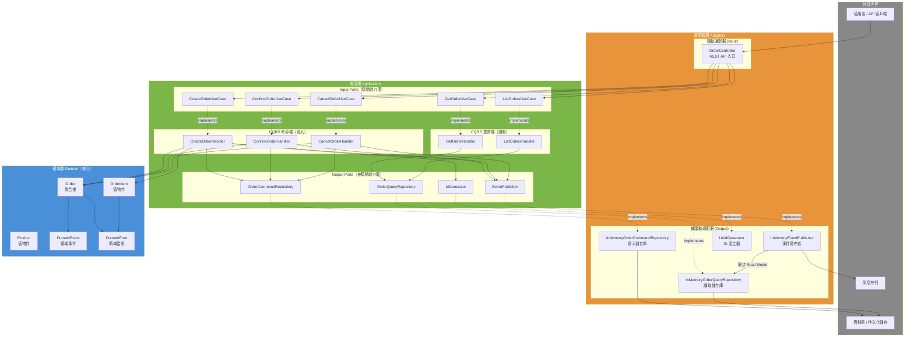

### 依賴方向（由外向內）

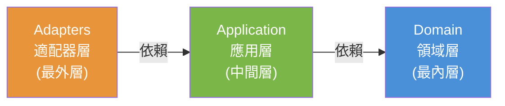

> **關鍵規則**：依賴只能由外層指向內層，內層絕不依賴外層。Domain 層零外部依賴。

---

## 類別圖

### Domain Layer 類別圖

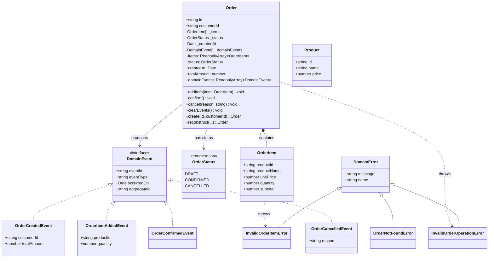

### Application Layer 類別圖（Ports & Handlers）

```mermaid
classDiagram
    %% Input Ports
    class CreateOrderUseCase {
        <<interface>>
        +execute(input: CreateOrderInput) Promise~CreateOrderOutput~
    }

    class GetOrderUseCase {
        <<interface>>
        +execute(orderId: string) Promise~OrderView~
    }

    class ListOrdersUseCase {
        <<interface>>
        +execute(customerId?: string) Promise~OrderView[]~
    }

    class ConfirmOrderUseCase {
        <<interface>>
        +execute(orderId: string) Promise~ConfirmOrderOutput~
    }

    class CancelOrderUseCase {
        <<interface>>
        +execute(orderId: string, reason: string) Promise~CancelOrderOutput~
    }

    %% Output Ports
    class OrderCommandRepository {
        <<interface>>
        +save(order: Order) Promise~void~
        +findById(id: string) Promise~Order | null~
    }

    class OrderQueryRepository {
        <<interface>>
        +findById(id: string) Promise~OrderReadModel | null~
        +findAll() Promise~OrderReadModel[]~
        +findByCustomerId(customerId: string) Promise~OrderReadModel[]~
    }

    class EventPublisher {
        <<interface>>
        +publish(event: DomainEvent) Promise~void~
        +publishAll(events: DomainEvent[]) Promise~void~
    }

    class IdGenerator {
        <<interface>>
        +generate() string
    }

    %% Command Handlers
    class CreateOrderHandler {
        -OrderCommandRepository orderRepository
        -EventPublisher eventPublisher
        -IdGenerator idGenerator
        +execute(input) Promise~CreateOrderOutput~
    }

    class ConfirmOrderHandler {
        -OrderCommandRepository orderRepository
        -EventPublisher eventPublisher
        +execute(orderId) Promise~ConfirmOrderOutput~
    }

    class CancelOrderHandler {
        -OrderCommandRepository orderRepository
        -EventPublisher eventPublisher
        +execute(orderId, reason) Promise~CancelOrderOutput~
    }

    %% Query Handlers
    class GetOrderHandler {
        -OrderQueryRepository queryRepository
        +execute(orderId) Promise~OrderView~
    }

    class ListOrdersHandler {
        -OrderQueryRepository queryRepository
        +execute(customerId?) Promise~OrderView[]~
    }

    %% Relationships
    CreateOrderUseCase <|.. CreateOrderHandler : implements
    ConfirmOrderUseCase <|.. ConfirmOrderHandler : implements
    CancelOrderUseCase <|.. CancelOrderHandler : implements
    GetOrderUseCase <|.. GetOrderHandler : implements
    ListOrdersUseCase <|.. ListOrdersHandler : implements

    CreateOrderHandler --> OrderCommandRepository : uses
    CreateOrderHandler --> EventPublisher : uses
    CreateOrderHandler --> IdGenerator : uses
    ConfirmOrderHandler --> OrderCommandRepository : uses
    ConfirmOrderHandler --> EventPublisher : uses
    CancelOrderHandler --> OrderCommandRepository : uses
    CancelOrderHandler --> EventPublisher : uses
    GetOrderHandler --> OrderQueryRepository : uses
    ListOrdersHandler --> OrderQueryRepository : uses
```

### Adapter Layer 類別圖

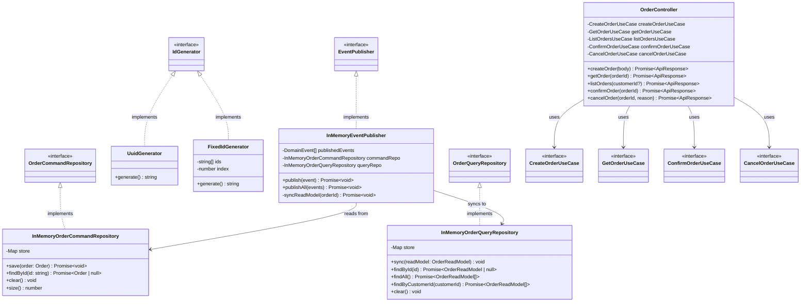

---

## 循序圖

### 1. 建立訂單（Command Flow - 寫入端）

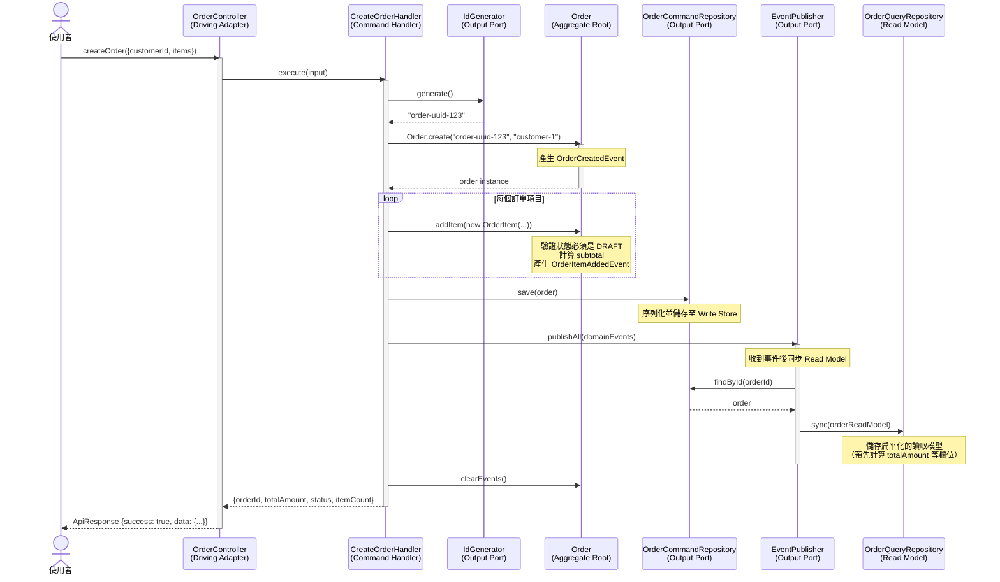

### 2. 查詢訂單（Query Flow - 讀取端）

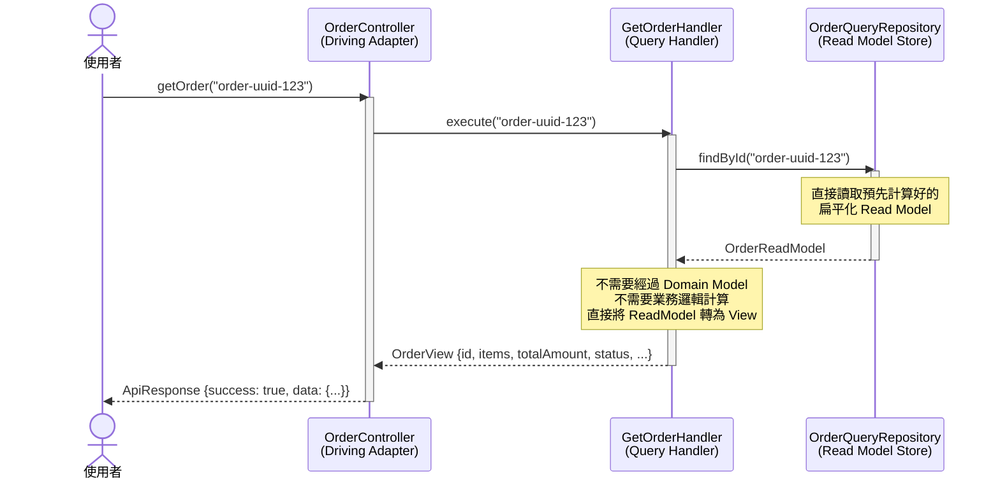

### 3. 確認訂單（Command Flow - 狀態轉換）

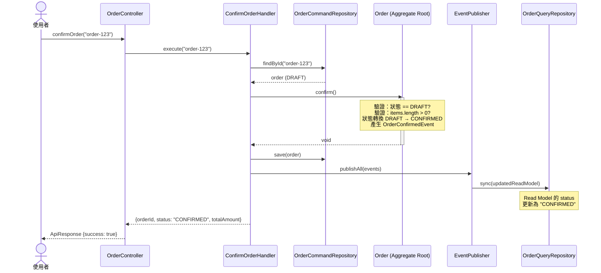

### 4. 訂單狀態機

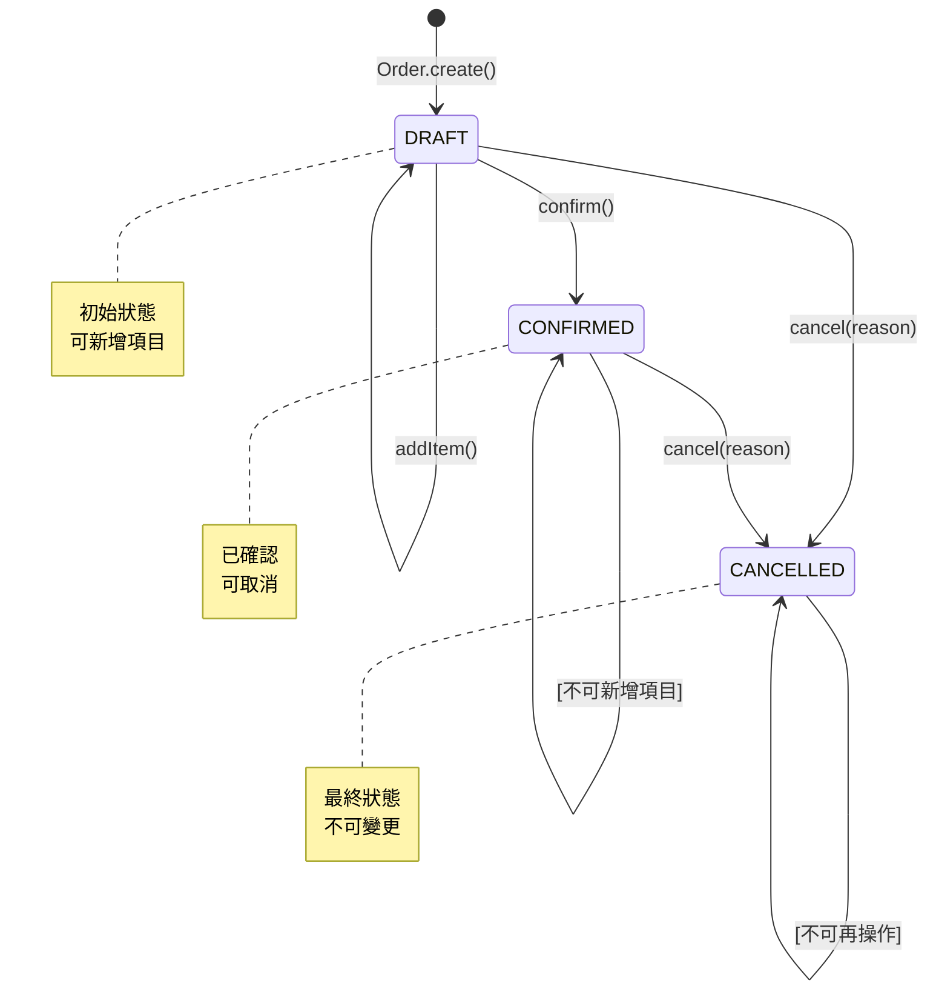

### 5. 依賴注入組裝流程

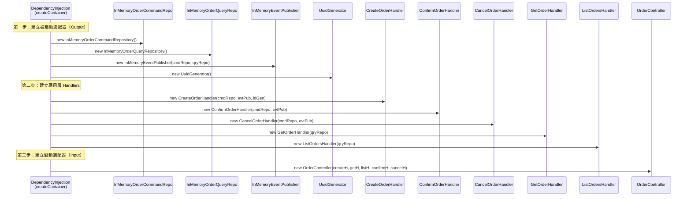

---

## 三大架構概念詳解

### 1. SOLID 原則

SOLID 是五個物件導向設計原則的首字母縮寫，指引我們寫出可維護、可擴展的程式碼。

#### S - Single Responsibility Principle（單一職責原則）

> 一個類別應該只有一個引起它變更的理由。

| 類別 | 職責 | 檔案位置 |
|------|------|---------|
| `Order` | 訂單業務邏輯（狀態轉換、驗證） | `src/domain/models/Order.ts` |
| `OrderItem` | 訂單項目計算（subtotal） | `src/domain/models/OrderItem.ts` |
| `CreateOrderHandler` | 只負責「建立訂單」 | `src/application/commands/CreateOrderHandler.ts` |
| `GetOrderHandler` | 只負責「查詢訂單」 | `src/application/queries/GetOrderHandler.ts` |
| `OrderController` | 只負責「HTTP 請求轉換」 | `src/adapters/input/api/OrderController.ts` |

**反例對照**：如果把建立、查詢、確認、取消全部放在同一個 `OrderService` 中，任何一個操作的變更都會影響整個類別。

#### O - Open/Closed Principle（開放封閉原則）

> 軟體實體應該對擴展開放，對修改封閉。

```typescript
// DomainEvent 介面對擴展開放 ─ 新增事件類型不需修改現有程式碼
interface DomainEvent { eventId; eventType; occurredOn; aggregateId; }

class OrderCreatedEvent   implements DomainEvent { ... }  // 已有
class OrderConfirmedEvent implements DomainEvent { ... }  // 已有
class OrderShippedEvent   implements DomainEvent { ... }  // ← 未來新增，不需改動其他類別
```

#### L - Liskov Substitution Principle（里氏替換原則）

> 子類別必須可以替換其父類別而不影響程式的正確性。

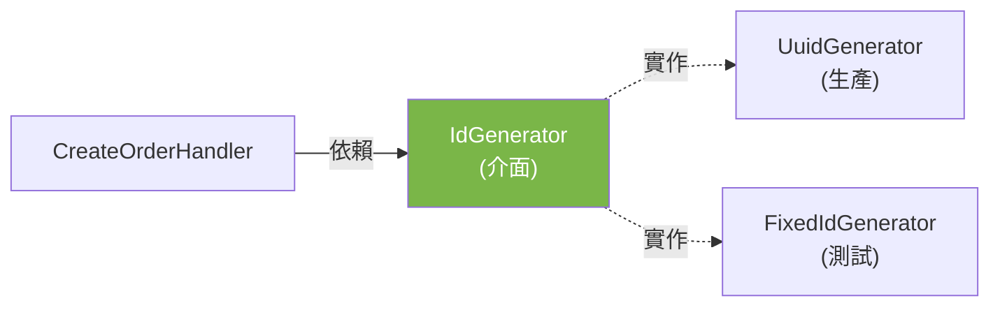

`UuidGenerator` 和 `FixedIdGenerator` 都實作 `IdGenerator`，可在任何場景無縫替換。測試時用 `FixedIdGenerator`，生產環境用 `UuidGenerator`。

#### I - Interface Segregation Principle（介面隔離原則）

> 客戶端不應該被迫依賴它不使用的介面。

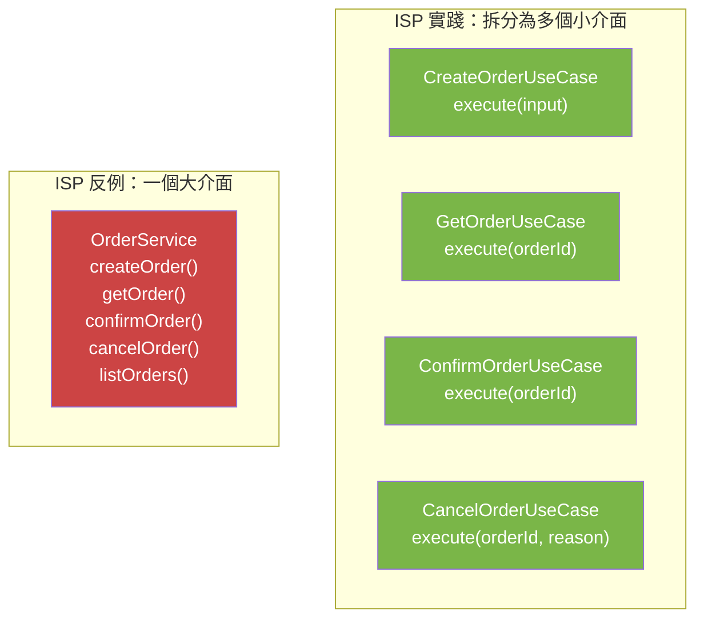

同樣，CQRS 中的 `OrderCommandRepository`（寫入）和 `OrderQueryRepository`（讀取）也是 ISP 的體現 ─ 查詢端不需要 `save()` 方法。

#### D - Dependency Inversion Principle（依賴反轉原則）

> 高階模組不應該依賴低階模組，兩者都應該依賴抽象。

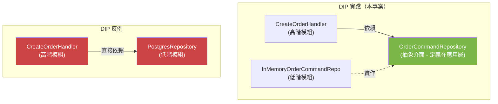

在 DI Container 中，所有具體類別只在這一處被實例化：

```typescript
// DependencyInjection.ts - 唯一知道所有具體類別的地方
const commandRepo = new InMemoryOrderCommandRepository(); // ← 具體類別
const createOrderHandler = new CreateOrderHandler(
  commandRepo,     // ← 透過 OrderCommandRepository 介面注入
  eventPublisher,  // ← 透過 EventPublisher 介面注入
  idGenerator,     // ← 透過 IdGenerator 介面注入
);
```

---

### 2. 六角形架構 (Hexagonal Architecture)

又稱 **Ports & Adapters** 架構，由 Alistair Cockburn 於 2005 年提出。

#### 核心思想

> 讓應用程式核心與外部世界（UI、資料庫、API）完全隔離，透過「Port（介面）」和「Adapter（適配器）」來溝通。

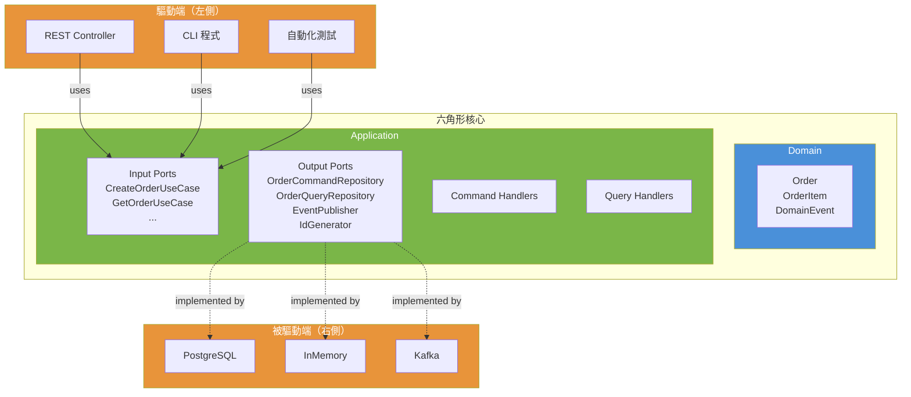

#### 三層對應

| 層級 | 別名 | 本專案對應 | 職責 |
|------|------|----------|------|
| **Domain** | 核心 / Entity | `Order`, `OrderItem`, `Product`, `DomainEvent` | 純業務邏輯，零外部依賴 |
| **Application** | Use Cases / Ports | `Ports/`, `Commands/`, `Queries/` | 定義介面、協調業務流程 |
| **Adapters** | Infrastructure | `Controller`, `Repository`, `Publisher` | 與外部技術對接 |

#### Port 與 Adapter 對照表

| Port（介面） | 方向 | Adapter（實作） | 用途 |
|-------------|------|----------------|------|
| `CreateOrderUseCase` | Input | `OrderController` 呼叫 | HTTP → Use Case |
| `GetOrderUseCase` | Input | `OrderController` 呼叫 | HTTP → Use Case |
| `OrderCommandRepository` | Output | `InMemoryOrderCommandRepository` | 持久化寫入 |
| `OrderQueryRepository` | Output | `InMemoryOrderQueryRepository` | 持久化讀取 |
| `EventPublisher` | Output | `InMemoryEventPublisher` | 事件發布 |
| `IdGenerator` | Output | `UuidGenerator` / `FixedIdGenerator` | ID 產生 |

---

### 3. CQRS 模式

由 Greg Young 基於 Bertrand Meyer 的 CQS (Command-Query Separation) 原則提出。

#### 核心思想

> 將「改變狀態的操作（Command）」和「讀取狀態的操作（Query）」分離到不同的模型與路徑中。

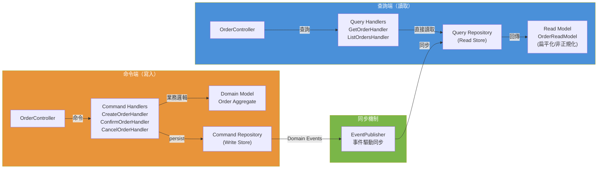

#### 寫入模型 vs 讀取模型

| 面向 | Command Model（寫入） | Query Model（讀取） |
|------|---------------------|-------------------|
| **資料結構** | `Order` 聚合根（正規化、封裝業務邏輯） | `OrderReadModel`（扁平化、非正規化） |
| **行為** | `addItem()`, `confirm()`, `cancel()` | 無行為，純資料結構 |
| **驗證** | 嚴格的業務規則驗證 | 不需要驗證 |
| **計算** | 即時計算 `totalAmount` | 預先計算好 `totalAmount` |
| **效能優化** | 事務一致性 | 查詢速度（可加快取、索引等） |
| **儲存庫** | `OrderCommandRepository` | `OrderQueryRepository` |

#### 程式碼比較

**Command Side - 經過完整的 Domain 邏輯：**
```typescript
// CreateOrderHandler.execute()
const order = Order.create(orderId, customerId);     // 建立聚合根
order.addItem(new OrderItem(productId, name, 2500, 1)); // 業務驗證
await this.orderRepository.save(order);               // 寫入 Command Store
await this.eventPublisher.publishAll(order.domainEvents); // 觸發事件 → 同步 Read Model
```

**Query Side - 直接讀取 Read Model，跳過 Domain 邏輯：**
```typescript
// GetOrderHandler.execute()
const readModel = await this.queryRepository.findById(orderId); // 直接讀
return { id: readModel.id, totalAmount: readModel.totalAmount, ... }; // 直接回傳
```

---

## 架構比較與優劣分析

### 六角形架構 vs 傳統三層式架構 vs Clean Architecture

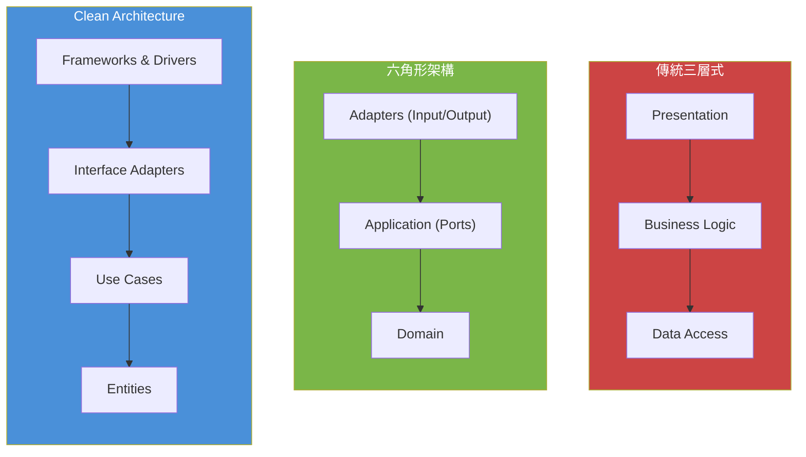

| 面向 | 傳統三層式 | 六角形架構 | Clean Architecture |
|------|----------|----------|-------------------|
| **核心概念** | UI → Logic → DB | Ports & Adapters | Dependency Rule |
| **依賴方向** | 上層依賴下層 | 外層依賴內層 | 外層依賴內層 |
| **DB 依賴** | Business 直接依賴 DB 層 | 透過 Output Port 抽象 | 透過 Gateway 介面抽象 |
| **可測試性** | 中等（需 mock DB） | 高（Port 可替換） | 高（同六角形） |
| **複雜度** | 低 | 中 | 高（層數更多） |
| **適合規模** | 小型專案 | 中大型專案 | 大型專案 |
| **學習曲線** | 低 | 中 | 高 |

### 六角形架構優劣分析

| | 說明 |
|---|------|
| **優點** | |
| 可測試性極高 | Domain 零依賴，可直接單元測試；Adapter 可輕鬆替換為 InMemory 實作 |
| 技術可替換性 | 更換資料庫只需新增 Adapter，核心不變 |
| 業務邏輯純粹 | Domain 層不受框架、資料庫等技術選擇影響 |
| 關注點分離 | 每一層有明確的職責邊界 |
| 並行開發 | 定義好 Port 介面後，不同團隊可以同時開發各層 |
| **缺點** | |
| 前期成本高 | 需要定義大量介面和適配器，簡單 CRUD 可能過度設計 |
| 學習門檻 | 團隊成員需要理解 Port/Adapter 概念 |
| 間接性增加 | 呼叫鏈變長：Controller → Port → Handler → Domain → Port → Adapter |
| 檔案數量多 | 本專案 23 個原始檔，同樣功能用傳統架構可能只需 5-6 個 |

### CQRS 優劣分析

| | 說明 |
|---|------|
| **優點** | |
| 讀寫獨立擴展 | 讀取端可加 cache/replica，寫入端可垂直擴展 |
| 讀取效能優化 | Read Model 可針對查詢場景非正規化，避免多表 JOIN |
| 模型簡化 | Command Model 專注業務邏輯，Query Model 專注展示需求 |
| 職責清晰 | Command Handler 和 Query Handler 各司其職（SRP） |
| Event Sourcing 基礎 | CQRS 是導入 Event Sourcing 的必要基礎 |
| **缺點** | |
| 複雜度增加 | 需要維護兩套模型和同步機制 |
| 資料一致性 | Read Model 可能存在延遲（最終一致性），不適合強一致性場景 |
| 開發成本 | 每個操作需要分開實作 Command 和 Query 兩端 |
| 偵錯困難 | 事件驅動的同步機制在出錯時較難追蹤 |
| 不適合簡單 CRUD | 讀寫模型幾乎相同時，CQRS 帶來不必要的複雜度 |

### CQRS 三種演進層級

| 層級 | 說明 | 一致性 | 複雜度 | 本專案 |
|------|------|--------|--------|--------|
| **Level 1** | 同一 DB，不同模型 | 強一致 | 低 | ✅ |
| **Level 2** | 不同 DB（如 PostgreSQL + Elasticsearch） | 最終一致 | 中 | |
| **Level 3** | Event Sourcing + Materialized View | 最終一致 | 高 | |

### 何時該用 / 不該用這些架構？

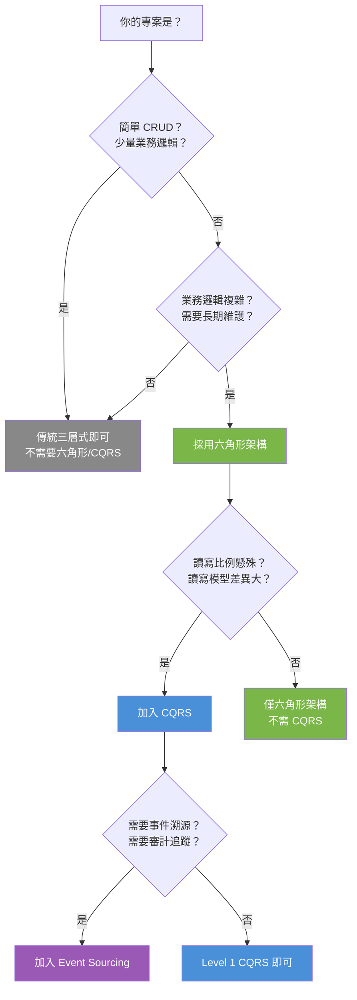

---

## 測試

```bash
npm test              # 執行全部測試
npm run test:coverage # 測試覆蓋率
```

### 測試結構總覽

| 測試檔案 | 層級 | 測試目標 | 數量 |
|---------|------|---------|------|
| `Order.test.ts` | Domain | 聚合根、值物件、狀態轉換、事件 | 25 |
| `CreateOrderHandler.test.ts` | Application (Command) | 建立訂單流程、事件發布、讀取模型同步 | 5 |
| `ConfirmAndCancelHandler.test.ts` | Application (Command) | 確認/取消訂單流程 | 5 |
| `GetOrderHandler.test.ts` | Application (Query) | CQRS 查詢端、列表過濾 | 4 |
| `OrderController.test.ts` | Adapter (Integration) | 端到端完整生命週期 | 7 |
| **合計** | | | **46** |

### 為什麼測試這麼容易寫？

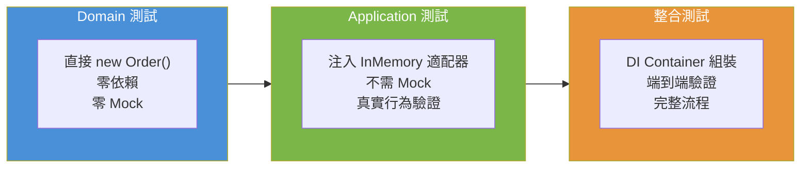

- **Domain 測試**：零依賴，直接 `new` 出來就能測
- **Application 測試**：用 `InMemory` 適配器，不需要 Mock，驗證真實行為
- **整合測試**：用 `createContainer()` 組裝所有元件，端到端驗證

---

## 教學文件

詳細的概念說明與程式碼解析，請參考 `docs/` 目錄：

| 文件 | 內容 |
|------|------|
| [SOLID 原則](docs/01-solid-principles.md) | 五大原則詳細說明、程式碼對照、反例分析 |
| [六角形架構](docs/02-hexagonal-architecture.md) | Ports & Adapters 詳解、三層結構、依賴方向 |
| [CQRS 模式](docs/03-cqrs-pattern.md) | 命令查詢分離、讀寫模型、同步機制、三種層級 |

---

## 延伸思考

### 如何擴展此架構？

| 擴展項目 | 做法 | 影響範圍 |
|---------|------|---------|
| 加入 REST API | 建立 Express/Fastify Driving Adapter | 只新增 Adapter，Application/Domain 不變 |
| 換成 PostgreSQL | 實作 `PostgresOrderCommandRepository` | 只新增 Adapter，Application/Domain 不變 |
| 加入 Redis 快取 | 實作帶快取的 `CachedOrderQueryRepository` | 只新增 Adapter |
| 加入 Kafka 訊息佇列 | 實作 `KafkaEventPublisher` | 只新增 Adapter |
| 加入 Event Sourcing | 將 Command Store 改為 Event Store | 新增 Adapter + 修改 EventPublisher |
| 微服務拆分 | Command/Query 部署為獨立服務 | 架構層級的變更 |

### 延伸閱讀

- Alistair Cockburn - Hexagonal Architecture (Ports & Adapters)
- Robert C. Martin - Clean Architecture
- Greg Young - CQRS and Event Sourcing
- Vaughn Vernon - Implementing Domain-Driven Design
- Martin Fowler - CQRS Pattern
