# 六角形架構 + CQRS + SOLID 原則教學

> **Java 21 + Spring Boot 4** 實作範例 — 訂單管理系統

本專案透過一個完整的「訂單管理系統」，示範如何結合 **六角形架構（Hexagonal Architecture / Ports & Adapters）**、**CQRS（Command Query Responsibility Segregation）** 和 **SOLID 原則**，打造高內聚、低耦合、易測試的企業級應用程式。

---

## 目錄

- [技術棧](#技術棧)
- [快速開始](#快速開始)
- [架構圖](#架構圖)
- [類別圖](#類別圖)
- [循序圖](#循序圖)
- [狀態機圖](#狀態機圖)
- [SOLID 原則對照](#solid-原則對照)
- [CQRS 模式詳解](#cqrs-模式詳解)
- [六角形架構詳解](#六角形架構詳解)
- [專案結構](#專案結構)
- [API 端點](#api-端點)
- [測試](#測試)
- [架構優劣比較](#架構優劣比較)
- [Java 21 特性展示](#java-21-特性展示)

---

## 技術棧

| 技術 | 版本 | 用途 |
|------|------|------|
| Java | 21 | Records、Sealed Interfaces、Text Blocks |
| Spring Boot | 4.0.0 | Web 框架、依賴注入、測試 |
| Spring Framework | 7.0 | 核心框架 |
| Maven | 3.9+ | 建構工具 |
| JUnit | 6.0 | 單元測試 |
| AssertJ | 3.27 | 流暢斷言 |
| MockMvc | — | REST 整合測試 |

---

## 快速開始

```bash
# 編譯
mvn compile

# 執行測試（46 個測試）
mvn test

# 啟動應用程式
mvn spring-boot:run

# 建立訂單
curl -X POST http://localhost:8080/api/orders \
  -H "Content-Type: application/json" \
  -d '{
    "customerId": "c1",
    "items": [
      {"productId": "p1", "productName": "鍵盤", "unitPrice": 2500, "quantity": 1},
      {"productId": "p2", "productName": "滑鼠", "unitPrice": 800, "quantity": 2}
    ]
  }'
```

---

## 架構圖

### 整體六角形架構 + CQRS 全景

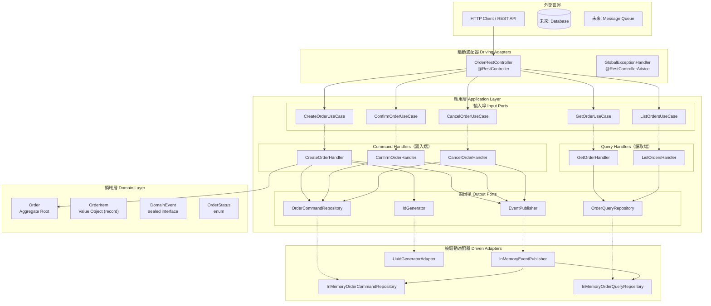

### 依賴方向（DIP 體現）

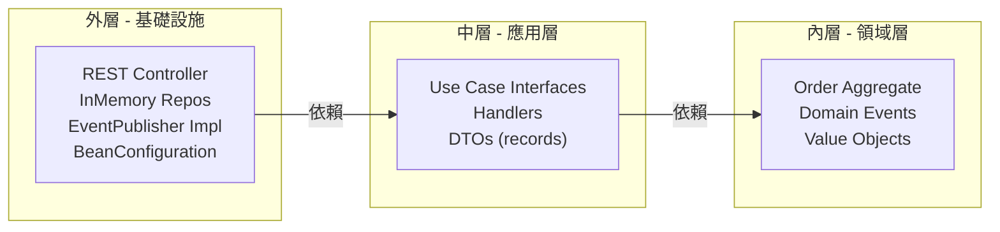

> **關鍵規則**：依賴只能由外層指向內層。Domain 層對 Spring 框架零依賴。

---

## 類別圖

### 領域模型類別圖

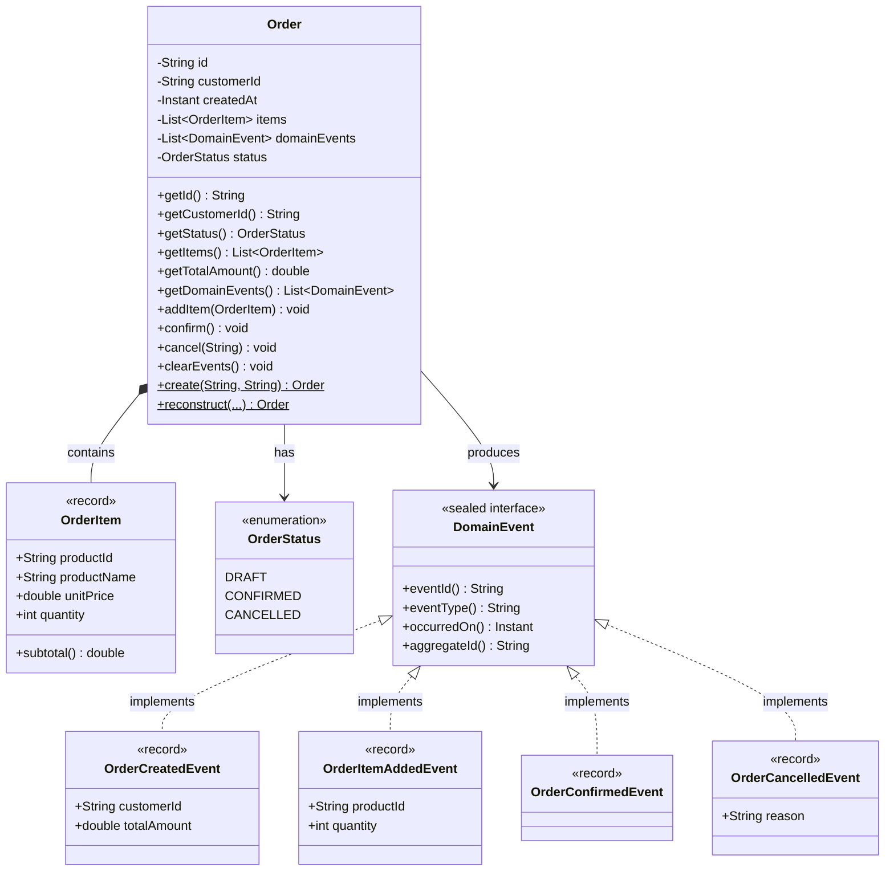

### Ports & Adapters 類別圖

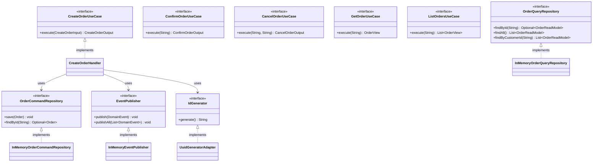

---

## 循序圖

### 建立訂單（Command 流程）

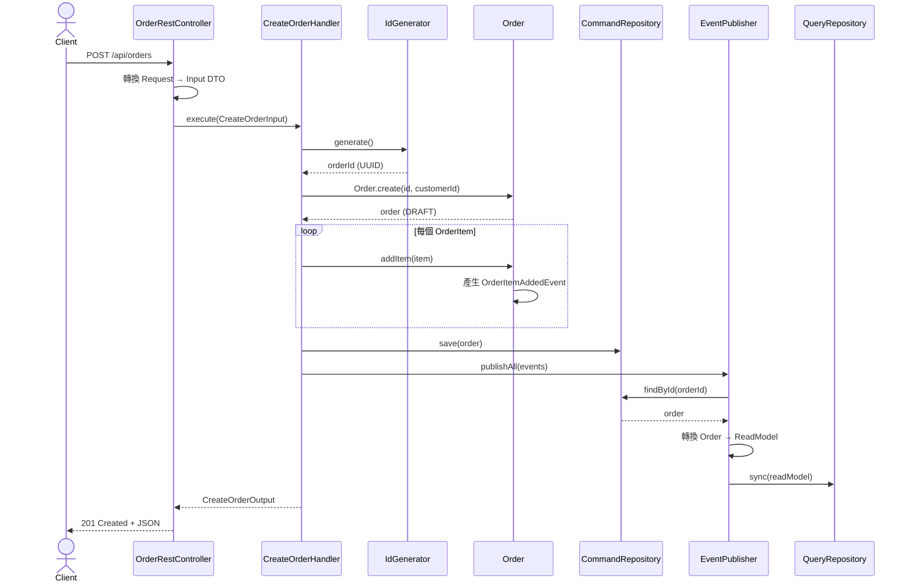

### 確認訂單（狀態轉換）

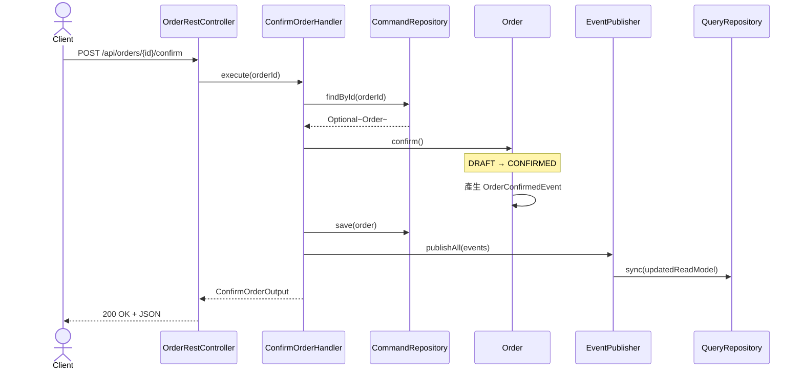

### 查詢訂單（Query 流程 — CQRS 讀取端）

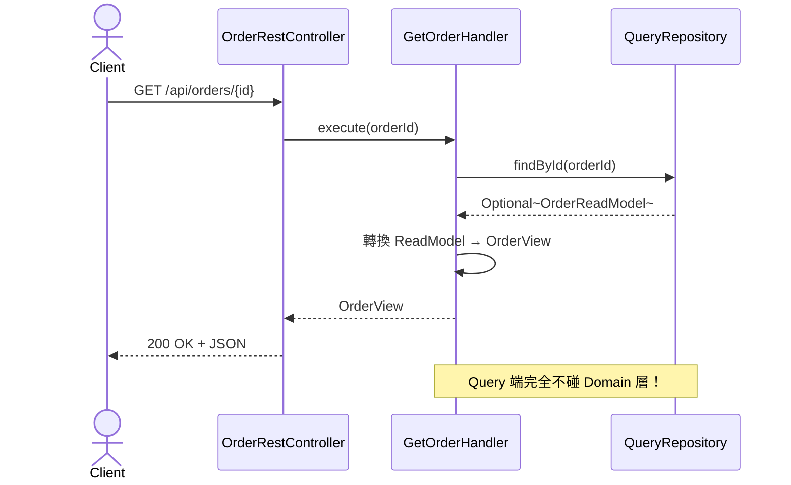

---

## 狀態機圖

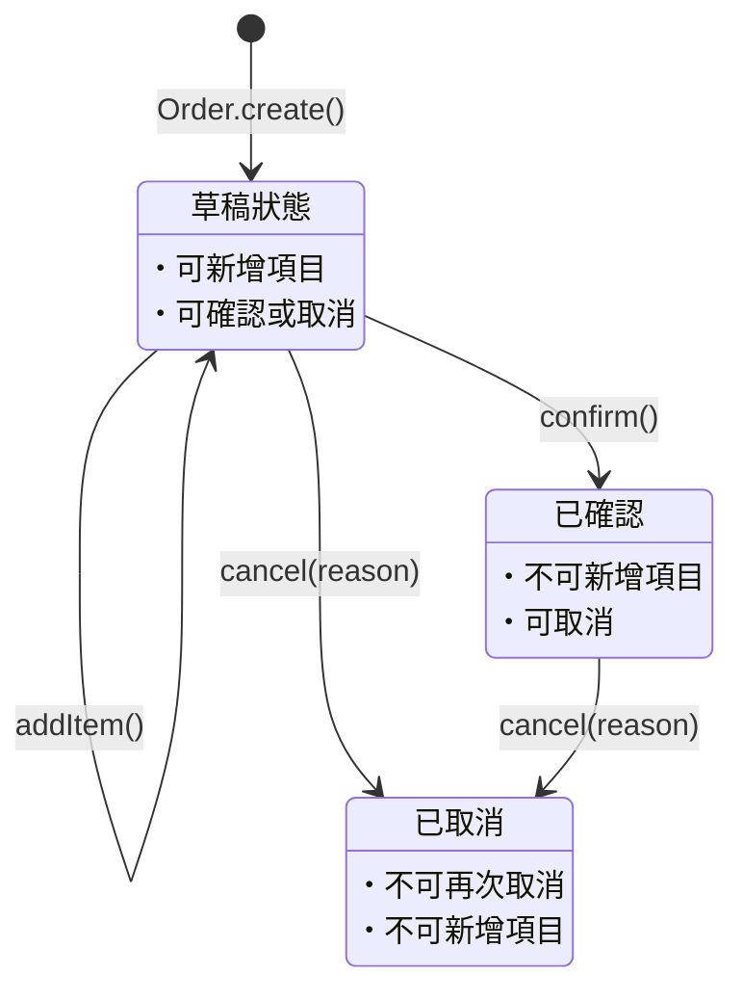

---

## SOLID 原則對照

### S — 單一職責原則 (SRP)

| 類別 | 職責 | 變更原因 |
|------|------|----------|
| `Order` | 訂單業務邏輯 | 業務規則變更 |
| `OrderRestController` | HTTP ↔ UseCase 轉換 | API 規格變更 |
| `CreateOrderHandler` | 建立訂單應用邏輯 | 建立流程變更 |
| `GetOrderHandler` | 查詢訂單應用邏輯 | 查詢需求變更 |
| `InMemoryEventPublisher` | 事件發布與 Read Model 同步 | 同步機制變更 |

### O — 開放封閉原則 (OCP)

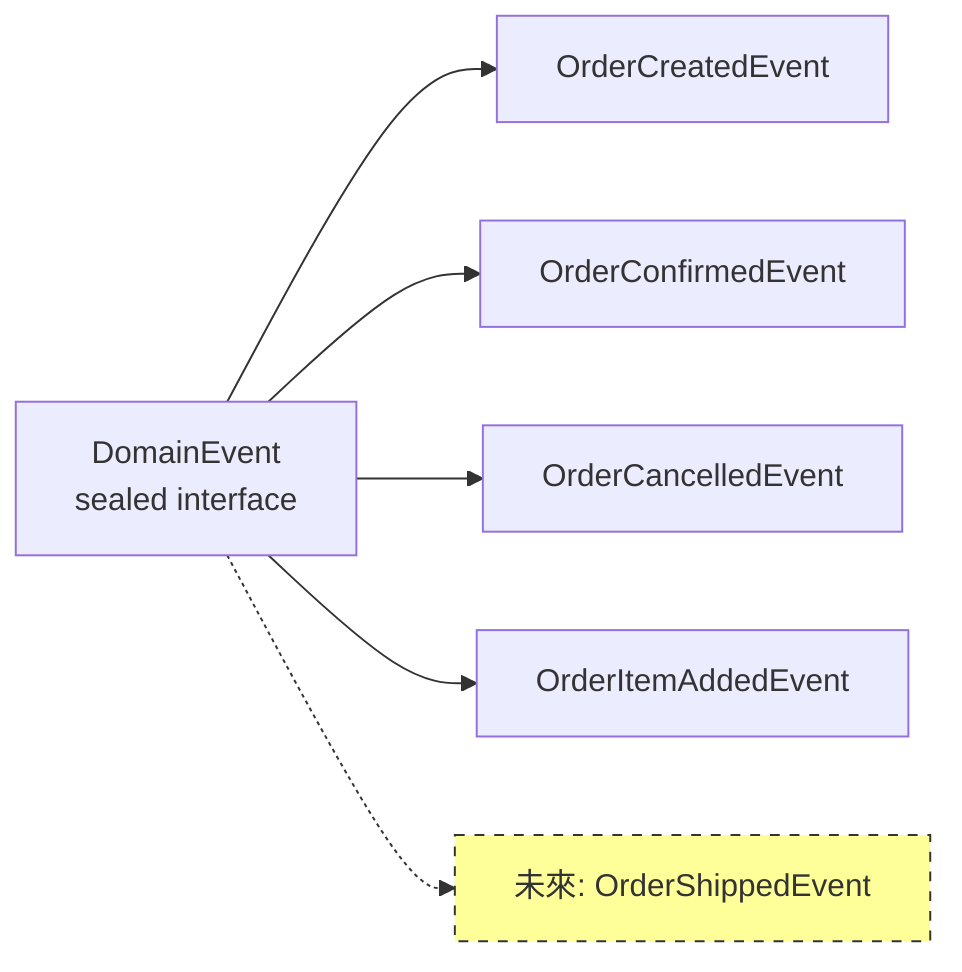

新增事件類型只需新增 `record` 並加入 `permits` 清單，不需修改現有程式碼。

### L — 里氏替換原則 (LSP)

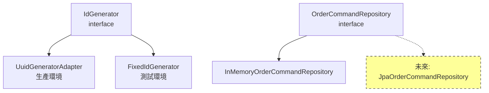

### I — 介面隔離原則 (ISP)

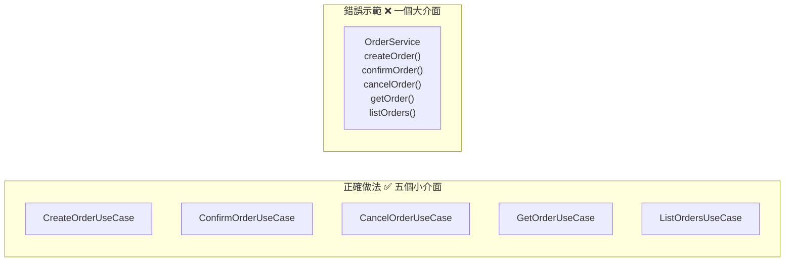

CQRS 也是 ISP 的體現：`OrderCommandRepository`（寫入）≠ `OrderQueryRepository`（讀取）。

### D — 依賴反轉原則 (DIP)

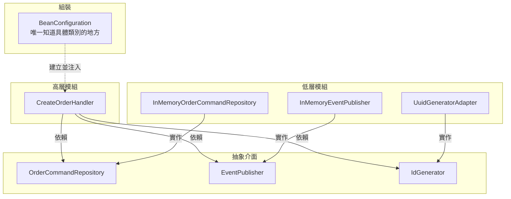

`BeanConfiguration` 是唯一知道所有具體類別的地方。Domain 和 Application 層對 Spring 框架零依賴。

---

## CQRS 模式詳解

### Command 端 vs Query 端

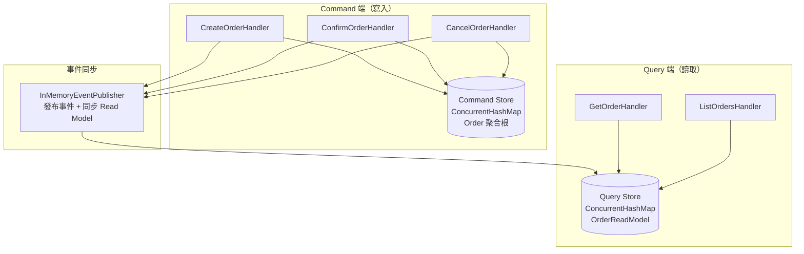

### 寫入模型 vs 讀取模型

| 面向 | Command 端 | Query 端 |
|------|-----------|----------|
| **資料模型** | `Order`（聚合根） | `OrderReadModel`（record，扁平化） |
| **儲存** | `OrderCommandRepository` | `OrderQueryRepository` |
| **特性** | 包含領域邏輯、狀態驗證 | 無領域邏輯、預計算 |
| **操作** | `save()`, `findById()` | `findById()`, `findAll()`, `findByCustomerId()` |

---

## 六角形架構詳解

### 三層責任

| 層級 | 責任 | Spring 依賴 | 範例 |
|------|------|------------|------|
| **Domain** | 核心業務規則 | ❌ 無 | `Order`, `OrderItem`, `DomainEvent` |
| **Application** | 應用邏輯、Port 定義 | ❌ 無 | `CreateOrderHandler`, Use Case 介面 |
| **Adapter** | 外部技術整合 | ✅ 有 | `OrderRestController`, InMemory 實作 |
| **Infrastructure** | 組裝與配置 | ✅ 有 | `BeanConfiguration` |

### Port 與 Adapter 對照

| Port（介面） | 方向 | Adapter（實作） |
|-------------|------|----------------|
| `CreateOrderUseCase` | Input | `OrderRestController` 呼叫 |
| `OrderCommandRepository` | Output | `InMemoryOrderCommandRepository` |
| `OrderQueryRepository` | Output | `InMemoryOrderQueryRepository` |
| `EventPublisher` | Output | `InMemoryEventPublisher` |
| `IdGenerator` | Output | `UuidGeneratorAdapter` / `FixedIdGenerator` |

---

## 專案結構

```
src/
├── main/java/com/example/hexagonal/
│   ├── HexagonalCqrsApplication.java          # Spring Boot 入口
│   │
│   ├── domain/                                 # 🔴 領域層（零框架依賴）
│   │   ├── model/
│   │   │   ├── Order.java                      #   聚合根（Aggregate Root）
│   │   │   ├── OrderItem.java                  #   值物件 (record)
│   │   │   ├── OrderStatus.java                #   狀態列舉
│   │   │   └── Product.java                    #   產品值物件 (record)
│   │   ├── event/
│   │   │   ├── DomainEvent.java                #   sealed interface
│   │   │   ├── OrderCreatedEvent.java          #   record
│   │   │   ├── OrderItemAddedEvent.java        #   record
│   │   │   ├── OrderConfirmedEvent.java        #   record
│   │   │   └── OrderCancelledEvent.java        #   record
│   │   └── exception/
│   │       ├── DomainException.java
│   │       ├── OrderNotFoundException.java
│   │       ├── InvalidOrderOperationException.java
│   │       └── InvalidOrderItemException.java
│   │
│   ├── application/                            # 🟡 應用層（零框架依賴）
│   │   ├── port/
│   │   │   ├── input/                          #   輸入埠（Use Case 介面）
│   │   │   │   ├── CreateOrderUseCase.java
│   │   │   │   ├── ConfirmOrderUseCase.java
│   │   │   │   ├── CancelOrderUseCase.java
│   │   │   │   ├── GetOrderUseCase.java
│   │   │   │   └── ListOrdersUseCase.java
│   │   │   └── output/                         #   輸出埠
│   │   │       ├── OrderCommandRepository.java
│   │   │       ├── OrderQueryRepository.java
│   │   │       ├── EventPublisher.java
│   │   │       └── IdGenerator.java
│   │   ├── command/                            #   Command Handlers（寫入端）
│   │   │   ├── CreateOrderHandler.java
│   │   │   ├── ConfirmOrderHandler.java
│   │   │   └── CancelOrderHandler.java
│   │   ├── query/                              #   Query Handlers（讀取端）
│   │   │   ├── GetOrderHandler.java
│   │   │   └── ListOrdersHandler.java
│   │   └── dto/                                #   DTO（全部為 record）
│   │       ├── CreateOrderInput.java
│   │       ├── CreateOrderOutput.java
│   │       ├── OrderItemInput.java
│   │       ├── OrderItemView.java
│   │       ├── OrderView.java
│   │       ├── OrderReadModel.java
│   │       ├── ConfirmOrderOutput.java
│   │       └── CancelOrderOutput.java
│   │
│   ├── adapter/                                # 🟢 適配器層
│   │   ├── input/rest/                         #   驅動適配器
│   │   │   ├── OrderRestController.java
│   │   │   ├── GlobalExceptionHandler.java
│   │   │   └── dto/
│   │   │       ├── CreateOrderRequest.java
│   │   │       └── CancelOrderRequest.java
│   │   └── output/                             #   被驅動適配器
│   │       ├── persistence/
│   │       │   ├── InMemoryOrderCommandRepository.java
│   │       │   └── InMemoryOrderQueryRepository.java
│   │       ├── messaging/
│   │       │   └── InMemoryEventPublisher.java
│   │       ├── UuidGeneratorAdapter.java
│   │       └── FixedIdGenerator.java
│   │
│   └── infrastructure/config/                  # ⚙️ 基礎設施
│       └── BeanConfiguration.java              #   DI 容器
│
└── test/java/com/example/hexagonal/
    ├── domain/model/
    │   └── OrderTest.java                      # 25 個領域測試
    ├── application/
    │   ├── command/
    │   │   ├── CreateOrderHandlerTest.java     # 5 個 Command 測試
    │   │   └── ConfirmAndCancelHandlerTest.java # 5 個狀態轉換測試
    │   └── query/
    │       └── GetOrderHandlerTest.java        # 4 個 Query 測試
    └── adapter/input/rest/
        └── OrderRestControllerTest.java        # 7 個 Spring Boot 整合測試
```

---

## API 端點

| 方法 | 路徑 | 說明 | 回應碼 |
|------|------|------|--------|
| `POST` | `/api/orders` | 建立訂單 | `201 Created` |
| `GET` | `/api/orders/{id}` | 查詢訂單 | `200 OK` / `404` |
| `GET` | `/api/orders` | 列出所有訂單 | `200 OK` |
| `GET` | `/api/orders?customerId=xxx` | 依客戶篩選 | `200 OK` |
| `POST` | `/api/orders/{id}/confirm` | 確認訂單 | `200 OK` |
| `POST` | `/api/orders/{id}/cancel` | 取消訂單 | `200 OK` |

---

## 測試

### 46 個測試，涵蓋三個層級

| 測試類別 | 數量 | 層級 | 類型 |
|----------|------|------|------|
| `OrderTest` | 25 | Domain | 純單元測試（零框架依賴） |
| `CreateOrderHandlerTest` | 5 | Application | 單元測試 |
| `ConfirmAndCancelHandlerTest` | 5 | Application | 單元測試 |
| `GetOrderHandlerTest` | 4 | Application (CQRS) | 單元測試 |
| `OrderRestControllerTest` | 7 | Adapter | Spring Boot 整合測試 |

```bash
mvn test
```

---

## 架構優劣比較

### 六角形架構 vs 傳統分層架構

| 面向 | 六角形架構 | 傳統分層架構 |
|------|-----------|-------------|
| **依賴方向** | 外 → 內（DIP） | 上 → 下 |
| **框架耦合** | 核心無框架依賴 | 各層可能依賴框架 |
| **可測試性** | 極高（純單元測試） | 需 Mock 框架 |
| **可替換性** | 適配器可獨立替換 | 替換需修改多層 |
| **學習成本** | 較高 | 較低 |
| **適用場景** | 複雜領域、長期維護 | 簡單 CRUD |

### CQRS vs 傳統 CRUD

| 面向 | CQRS | 傳統 CRUD |
|------|------|----------|
| **資料模型** | 讀寫分離 | 單一模型 |
| **查詢效能** | 可獨立優化 | 受限於寫入模型 |
| **擴展性** | 讀寫獨立擴展 | 一起擴展 |
| **複雜度** | 需要同步機制 | 簡單直接 |
| **一致性** | 最終一致性 | 強一致性 |

### 何時選擇此架構？

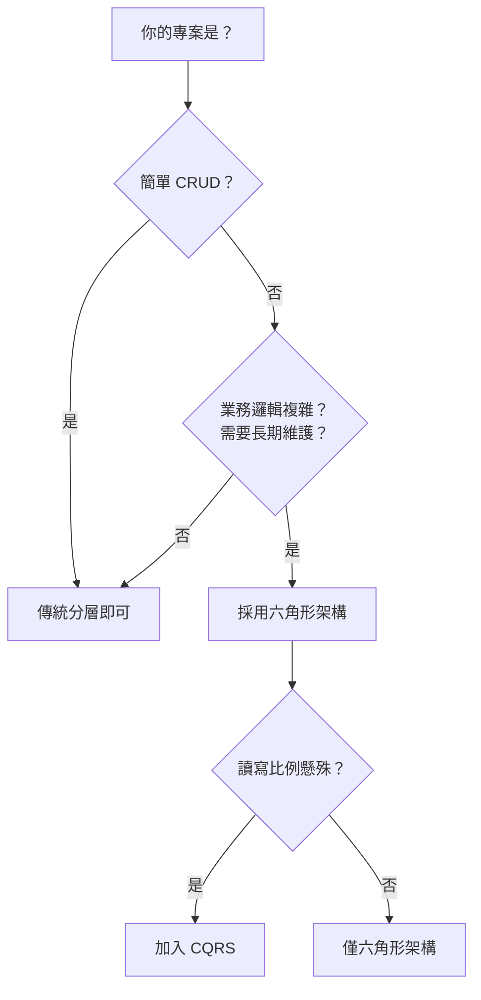

---

## Java 21 特性展示

| 特性 | 使用位置 | 說明 |
|------|----------|------|
| **Records** | DTO、Value Objects、Events | 不可變資料類別 |
| **Sealed Interfaces** | `DomainEvent` | 限制子類型，編譯期型別安全 |
| **Text Blocks** | 測試 JSON | 多行字串 |
| **Virtual Threads** | `application.yml` | `spring.threads.virtual.enabled: true` |

---

## 授權

本專案僅供教學用途。
