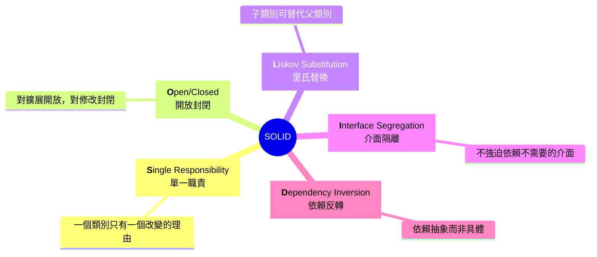
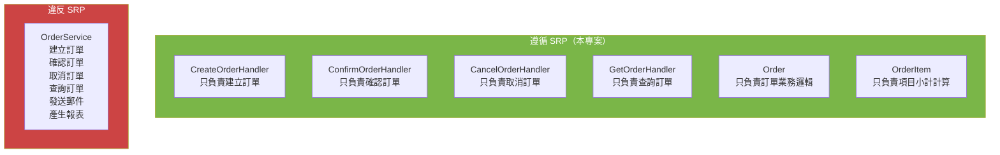
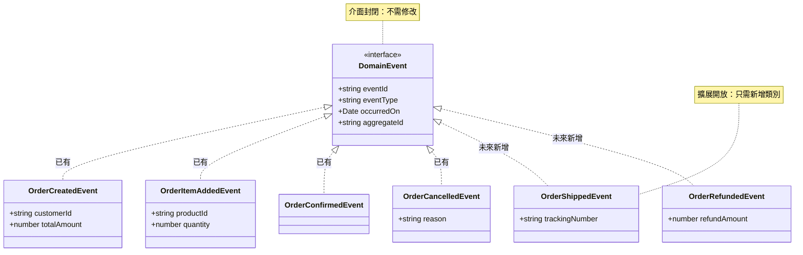
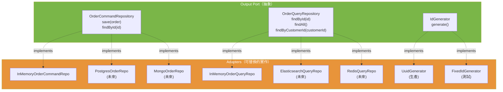
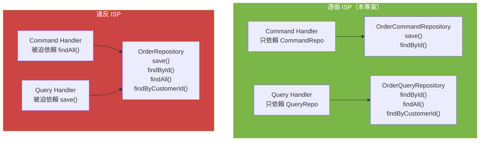
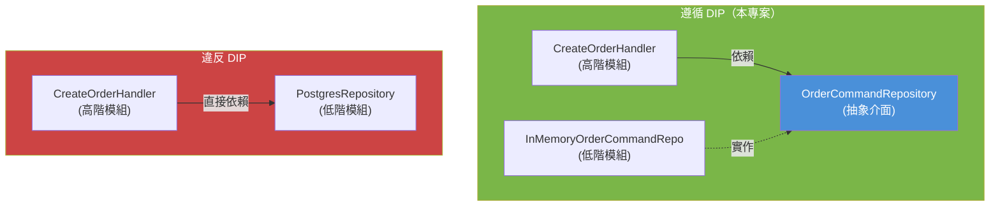
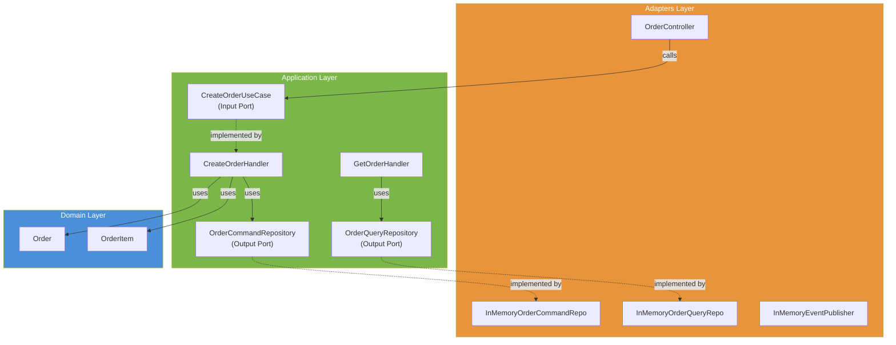
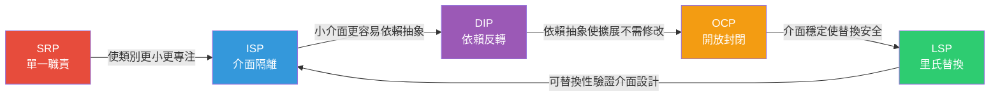

# SOLID 原則 - 物件導向設計的五大原則

## 概述

SOLID 是五個物件導向設計原則的首字母縮寫，由 Robert C. Martin 提出。
這些原則幫助開發者建立可維護、可擴展、可測試的軟體系統。



---

## S - 單一職責原則 (Single Responsibility Principle)

> **一個類別應該只有一個改變的理由。**

### 概念

每個類別只負責一件事。如果一個類別承擔了太多職責，
當其中一個職責需要改變時，可能會影響到其他職責。

### 本專案範例



| 類別 | 單一職責 | 改變的理由 |
|------|---------|----------|
| `Order` | 訂單業務邏輯（狀態轉換、驗證） | 訂單業務規則改變 |
| `OrderItem` | 訂單項目小計計算 | 項目計算邏輯改變 |
| `Product` | 產品資料驗證 | 產品驗證規則改變 |
| `CreateOrderHandler` | 建立訂單流程 | 建立訂單的流程改變 |
| `ConfirmOrderHandler` | 確認訂單流程 | 確認訂單的流程改變 |
| `GetOrderHandler` | 查詢訂單 | 查詢需求改變 |
| `OrderController` | HTTP 請求轉換 | API 格式改變 |

**對比錯誤做法：**

```typescript
// ❌ 違反 SRP - 一個類別做太多事（7 個改變的理由）
class OrderService {
  createOrder() { /* ... */ }    // 理由 1: 建立邏輯變更
  confirmOrder() { /* ... */ }   // 理由 2: 確認邏輯變更
  cancelOrder() { /* ... */ }    // 理由 3: 取消邏輯變更
  getOrder() { /* ... */ }       // 理由 4: 查詢需求變更
  listOrders() { /* ... */ }     // 理由 5: 列表需求變更
  sendEmail() { /* ... */ }      // 理由 6: 通知方式變更
  generateReport() { /* ... */ } // 理由 7: 報表格式變更
}

// ✅ 遵循 SRP - 每個 Handler 只做一件事（1 個改變的理由）
class CreateOrderHandler {
  async execute(input: CreateOrderInput): Promise<CreateOrderOutput> {
    // 只負責建立訂單的流程
  }
}
```

---

## O - 開放封閉原則 (Open/Closed Principle)

> **軟體實體應該對擴展開放，對修改封閉。**

### 概念

你應該能夠在不修改現有程式碼的情況下擴展系統行為。

### 本專案範例



**領域事件系統**展示了 OCP：

```typescript
// 基礎事件介面（封閉，不需修改）
interface DomainEvent {
  readonly eventId: string;
  readonly eventType: string;
  readonly occurredOn: Date;
  readonly aggregateId: string;
}

// 擴展新事件（開放，只需新增類別）
class OrderCreatedEvent implements DomainEvent { /* ... */ }
class OrderConfirmedEvent implements DomainEvent { /* ... */ }
class OrderCancelledEvent implements DomainEvent { /* ... */ }
// 未來新增：OrderShippedEvent, OrderRefundedEvent... 無需改動其他程式碼
```

**EventPublisher 也遵循 OCP：**

```typescript
// 不管有多少種事件，EventPublisher 的介面不需改變
interface EventPublisher {
  publish(event: DomainEvent): Promise<void>;
  publishAll(events: DomainEvent[]): Promise<void>;
}
```

---

## L - 里氏替換原則 (Liskov Substitution Principle)

> **子型別必須能夠替代其基本型別使用。**

### 概念

如果程式使用的是父類別（或介面），那麼換成任何子類別（或實作）
都不應該破壞程式的正確性。

### 本專案範例



**Application 層不需要知道用的是哪個實作：**

```typescript
// Handler 依賴介面，任何實作都可以替換
class CreateOrderHandler {
  constructor(
    private readonly orderRepository: OrderCommandRepository, // ← 介面
    private readonly eventPublisher: EventPublisher,           // ← 介面
    private readonly idGenerator: IdGenerator,                 // ← 介面
  ) {}
}

// DI Container 中切換實作：
const commandRepo = new InMemoryOrderCommandRepository(); // 開發用
// const commandRepo = new PostgresOrderRepository(conn); // 生產用
// const commandRepo = new MongoOrderRepository(client);   // 替代方案
```

### LSP 錯誤範例

```typescript
// ❌ 違反 LSP - 子類別行為與父類別不一致
class ReadOnlyRepository implements OrderCommandRepository {
  async save(order: Order): Promise<void> {
    throw new Error('此儲存庫不支援寫入'); // 違反 LSP！
  }
  async findById(id: string): Promise<Order | null> { /* ... */ }
}
```

> 如果一個實作無法完整支援介面的所有方法，說明介面應該被拆分（→ ISP）。

---

## I - 介面隔離原則 (Interface Segregation Principle)

> **客戶端不應該被迫依賴它不使用的介面。**

### 概念

用多個小而專注的介面取代一個大而全的介面。

### 本專案範例



**CQRS 中的讀寫分離就是 ISP 的完美體現：**

```typescript
// ❌ 違反 ISP - 一個大介面
interface OrderRepository {
  save(order: Order): Promise<void>;            // Query Handler 不需要
  findById(id: string): Promise<Order | null>;  // 兩邊都需要但回傳型別不同
  findAll(): Promise<OrderReadModel[]>;          // Command Handler 不需要
  findByCustomerId(cid: string): Promise<OrderReadModel[]>; // Command Handler 不需要
}

// ✅ 遵循 ISP - 分離的小介面
interface OrderCommandRepository {  // 寫入端只需要這些
  save(order: Order): Promise<void>;
  findById(id: string): Promise<Order | null>;
}

interface OrderQueryRepository {    // 讀取端只需要這些
  findById(id: string): Promise<OrderReadModel | null>;
  findAll(): Promise<OrderReadModel[]>;
  findByCustomerId(customerId: string): Promise<OrderReadModel[]>;
}
```

**Use Case 介面同樣遵循 ISP：**

```typescript
// 每個用例是獨立介面，Controller 可以選擇性依賴
interface CreateOrderUseCase {
  execute(input: CreateOrderInput): Promise<CreateOrderOutput>;
}

interface GetOrderUseCase {
  execute(orderId: string): Promise<OrderView>;
}

interface ConfirmOrderUseCase {
  execute(orderId: string): Promise<ConfirmOrderOutput>;
}

interface CancelOrderUseCase {
  execute(orderId: string, reason: string): Promise<CancelOrderOutput>;
}
```

---

## D - 依賴反轉原則 (Dependency Inversion Principle)

> **高階模組不應該依賴低階模組，兩者都應該依賴抽象。**

### 概念

業務邏輯（高階）不應該直接依賴資料庫、API 等（低階），
而是透過介面（抽象）來溝通。

### 本專案範例



**依賴方向圖（完整）：**



**DependencyInjection.ts 是唯一知道所有具體類別的地方：**

```typescript
// 在 DI 容器中組裝依賴
const commandRepo = new InMemoryOrderCommandRepository(); // 具體類別
const handler = new CreateOrderHandler(
  commandRepo,        // ← 注入時用具體類別
  eventPublisher,     //    但 Handler 只看到介面
  idGenerator,
);
```

---

## SOLID 原則之間的關係



| 關係 | 說明 |
|------|------|
| SRP → ISP | 類別職責單一後，自然形成小介面 |
| ISP → DIP | 小介面容易被抽象，促進依賴反轉 |
| DIP → OCP | 依賴抽象後，擴展只需新增實作，不需修改 |
| OCP → LSP | 介面穩定後，新實作可安全替換舊實作 |
| LSP → ISP | 替換性驗證介面設計是否合理 |

這五個原則相互支持，共同構成了穩固的軟體設計基礎。

---

## 本專案中 SOLID 原則的完整對照

| 原則 | 層級 | 具體體現 | 檔案位置 |
|------|------|---------|---------|
| **SRP** | Domain | `Order` 只管業務邏輯 | `src/domain/models/Order.ts` |
| **SRP** | Domain | `OrderItem` 只管小計計算 | `src/domain/models/OrderItem.ts` |
| **SRP** | Application | 每個 Handler 只處理一個用例 | `src/application/commands/*.ts` |
| **SRP** | Adapter | Controller 只負責 HTTP 轉換 | `src/adapters/input/api/OrderController.ts` |
| **OCP** | Domain | `DomainEvent` 介面可擴展新事件 | `src/domain/events/DomainEvent.ts` |
| **OCP** | Application | `EventPublisher` 不因新事件而修改 | `src/application/ports/output/EventPublisher.ts` |
| **LSP** | Adapter | `InMemoryRepo` 可被 `PostgresRepo` 替換 | `src/adapters/output/persistence/*.ts` |
| **LSP** | Adapter | `UuidGenerator` 可被 `FixedIdGenerator` 替換 | `src/adapters/output/IdGeneratorAdapter.ts` |
| **ISP** | Application | `CommandRepository` 與 `QueryRepository` 分離 | `src/application/ports/output/OrderRepository.ts` |
| **ISP** | Application | 每個 UseCase 是獨立介面 | `src/application/ports/input/*.ts` |
| **DIP** | Application | Handler 依賴 Port 介面 | `src/application/commands/CreateOrderHandler.ts` |
| **DIP** | Infrastructure | DI Container 是唯一知道具體類別的地方 | `src/infrastructure/DependencyInjection.ts` |
