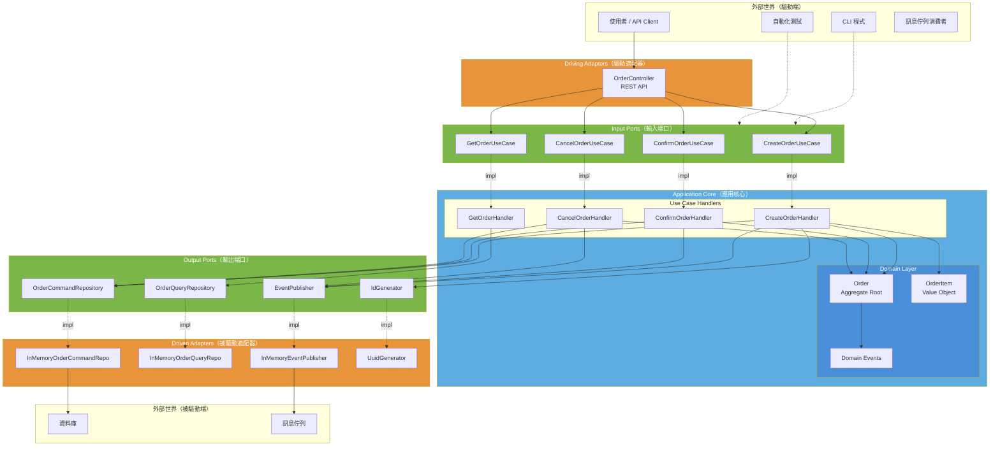
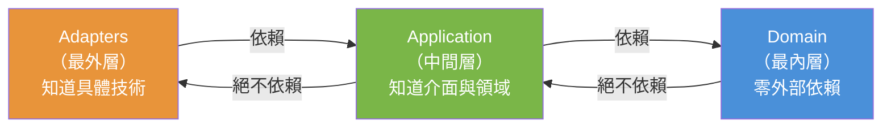
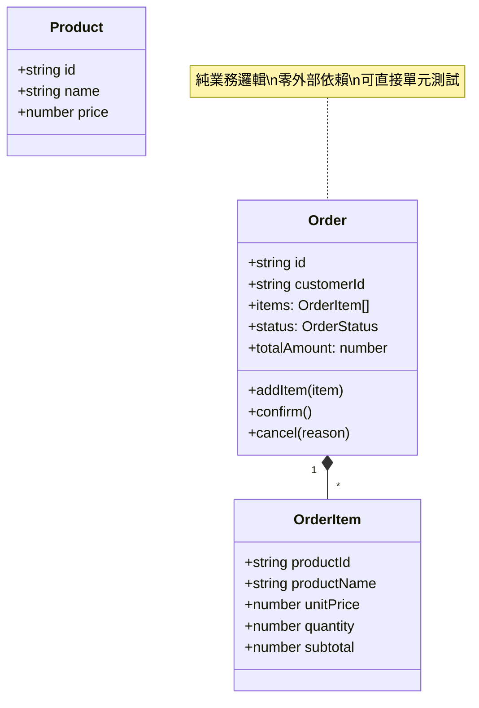
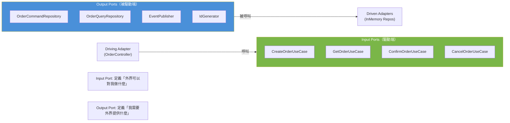
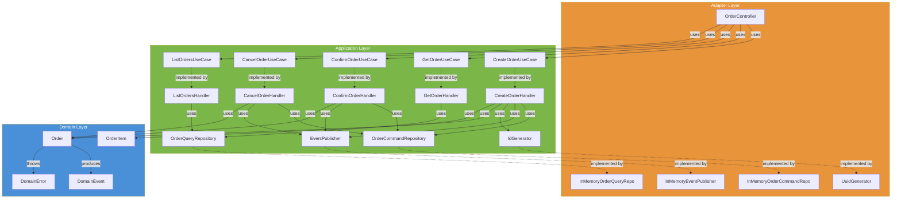
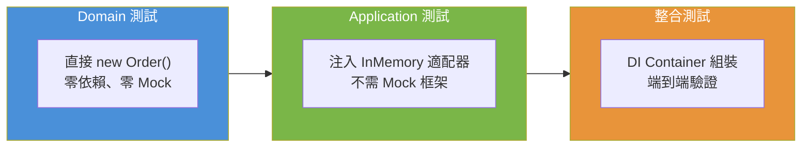
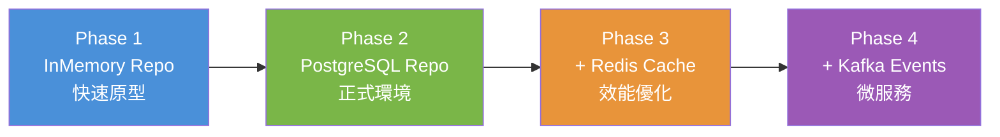
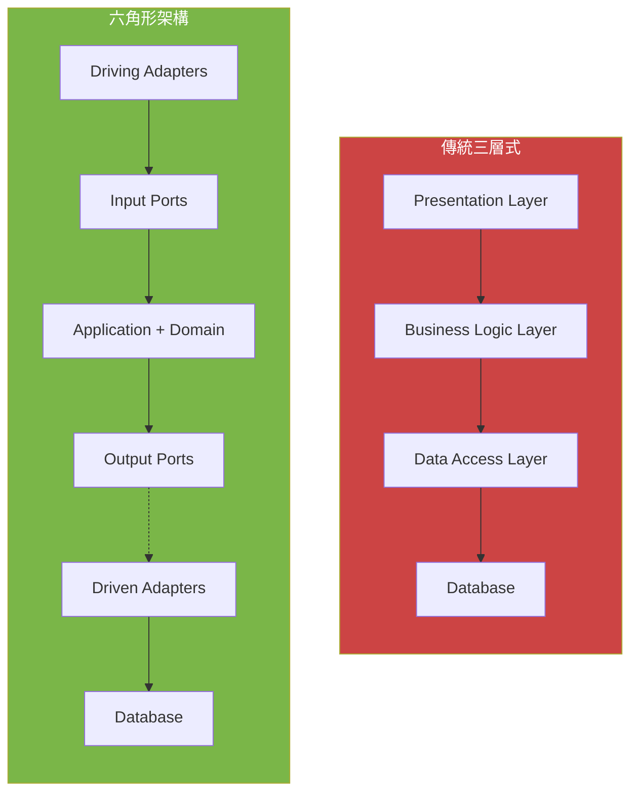
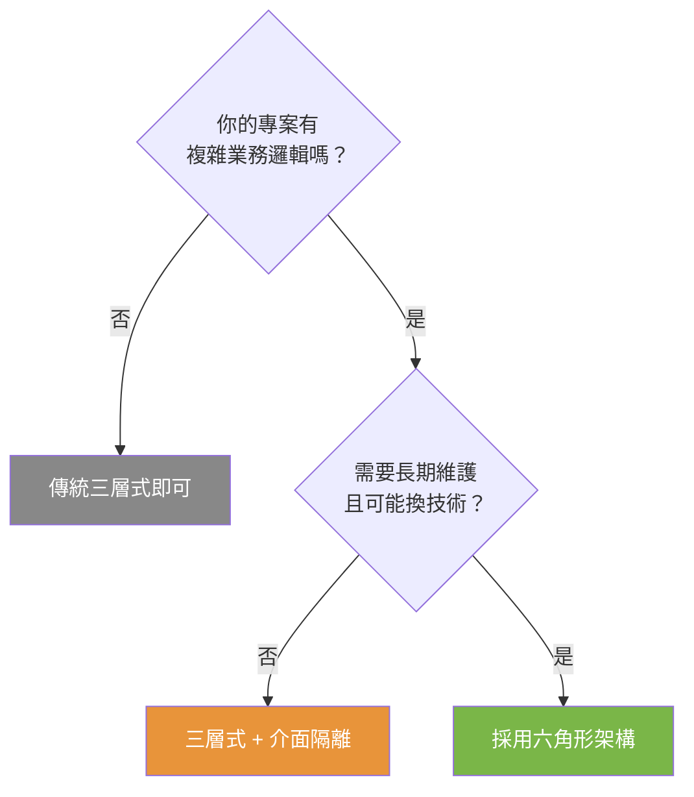

# 六角形架構 (Hexagonal Architecture)

## 又稱：Ports and Adapters 架構

由 Alistair Cockburn 於 2005 年提出。

---

## 核心思想

> **將應用程式的核心邏輯與外部世界完全隔離。**

外部世界包括：使用者介面、資料庫、訊息佇列、第三方 API 等。
核心邏輯不應該知道這些外部技術的存在。

---

## 架構圖

### 六角形全景



### 依賴方向（核心規則）



> **關鍵規則**：依賴只能由外層指向內層。Domain 層不 import 任何 Application 或 Adapter 的東西。

---

## 三層結構

### 1. Domain（領域層）— 最內層

```
src/domain/
├── models/
│   ├── Order.ts        ← 聚合根，封裝業務規則
│   ├── OrderItem.ts    ← 值物件
│   └── Product.ts      ← 值物件
├── events/
│   └── DomainEvent.ts  ← 領域事件
└── errors/
    └── DomainError.ts  ← 領域錯誤
```

**特點：**
- 零外部依賴（不依賴任何框架或基礎設施）
- 純粹的業務邏輯
- 可以用純單元測試驗證
- 是整個系統中最穩定的部分



### 2. Application（應用層）— 中間層

```
src/application/
├── ports/
│   ├── input/          ← Input Ports（外界呼叫我）
│   │   ├── CreateOrderUseCase.ts
│   │   ├── GetOrderUseCase.ts
│   │   ├── ConfirmOrderUseCase.ts
│   │   └── CancelOrderUseCase.ts
│   └── output/         ← Output Ports（我呼叫外界）
│       ├── OrderRepository.ts
│       ├── EventPublisher.ts
│       └── IdGenerator.ts
├── commands/           ← Command Handlers
│   ├── CreateOrderHandler.ts
│   ├── ConfirmOrderHandler.ts
│   └── CancelOrderHandler.ts
└── queries/            ← Query Handlers
    └── GetOrderHandler.ts
```

**特點：**
- 定義 Ports（介面）
- 實作 Use Cases（用例）
- 協調領域物件的互動
- 只依賴 Domain 層和 Port 介面

### 3. Adapters（適配器層）— 最外層

```
src/adapters/
├── input/              ← Driving Adapters（驅動）
│   └── api/
│       └── OrderController.ts
└── output/             ← Driven Adapters（被驅動）
    ├── persistence/
    │   ├── InMemoryOrderCommandRepository.ts
    │   └── InMemoryOrderQueryRepository.ts
    ├── messaging/
    │   └── InMemoryEventPublisher.ts
    └── IdGeneratorAdapter.ts
```

**特點：**
- 將外部技術轉換為內部可理解的形式
- 實作 Output Port 介面
- 呼叫 Input Port 介面
- 是唯一依賴具體技術的地方

---

## Ports 與 Adapters 詳解

### Input Ports vs Output Ports



| 比較 | Input Port | Output Port |
|------|-----------|-------------|
| **方向** | 外界 → 核心 | 核心 → 外界 |
| **定義者** | Application 層 | Application 層 |
| **實作者** | Application 層的 Handler | Adapter 層的具體類別 |
| **呼叫者** | Driving Adapter (Controller) | Application 層的 Handler |
| **範例** | `CreateOrderUseCase` | `OrderCommandRepository` |
| **角色** | 「我提供什麼服務」 | 「我需要什麼服務」 |

### Port ↔ Adapter 對照表

| Port（介面） | 方向 | Adapter（實作） | 用途 |
|-------------|------|----------------|------|
| `CreateOrderUseCase` | Input | `OrderController` 呼叫 | HTTP → Use Case |
| `GetOrderUseCase` | Input | `OrderController` 呼叫 | HTTP → Use Case |
| `ListOrdersUseCase` | Input | `OrderController` 呼叫 | HTTP → Use Case |
| `ConfirmOrderUseCase` | Input | `OrderController` 呼叫 | HTTP → Use Case |
| `CancelOrderUseCase` | Input | `OrderController` 呼叫 | HTTP → Use Case |
| `OrderCommandRepository` | Output | `InMemoryOrderCommandRepository` | 持久化寫入 |
| `OrderQueryRepository` | Output | `InMemoryOrderQueryRepository` | 持久化讀取 |
| `EventPublisher` | Output | `InMemoryEventPublisher` | 事件發布 |
| `IdGenerator` | Output | `UuidGenerator` / `FixedIdGenerator` | ID 產生 |

---

## 完整依賴方向圖



---

## 六角形架構的優勢

### 1. 可測試性



```typescript
// Domain 測試：零依賴
const order = Order.create('id', 'customer');
order.addItem(new OrderItem('p1', '鍵盤', 2500, 1));
order.confirm();
expect(order.status).toBe(OrderStatus.CONFIRMED);
```

### 2. 技術可替換性

更換資料庫只需要新增一個 Adapter：

```typescript
// 從記憶體切換到 PostgreSQL - 只需要換掉 DI 容器中的實作
const commandRepo = new PostgresOrderRepository(connection);
// ↑ 應用層和領域層完全不需修改
```

### 3. 業務邏輯純粹

業務規則集中在 Domain 層，不會散落在各處：

```typescript
// Order.ts 中清晰地表達了所有業務規則
confirm(): void {
  if (this._status !== OrderStatus.DRAFT) { throw ... }  // 狀態驗證
  if (this._items.length === 0) { throw ... }             // 業務規則
  this._status = OrderStatus.CONFIRMED;                    // 狀態轉換
}
```

### 4. 漸進式開發



---

## 六角形架構 vs 其他架構比較

### 與傳統三層式架構比較



| 面向 | 傳統三層式 | 六角形架構 |
|------|----------|----------|
| **依賴方向** | Presentation → Business → Data | Adapters → Application → Domain |
| **DB 耦合** | Business 直接依賴 Data 層 | 透過 Output Port 抽象隔離 |
| **可測試性** | 需要 Mock DB 層 | Domain 零依賴可直接測試 |
| **技術替換** | 需要修改多層 | 只需新增/替換 Adapter |
| **複雜度** | 低 | 中 |
| **適合場景** | 小型 CRUD | 中大型有複雜業務邏輯的系統 |

### 與 Clean Architecture 比較

| 面向 | 六角形架構 | Clean Architecture |
|------|----------|-------------------|
| **提出者** | Alistair Cockburn (2005) | Robert C. Martin (2012) |
| **層數** | 3 層 (Domain, Application, Adapters) | 4 層 (Entities, Use Cases, Interface Adapters, Frameworks) |
| **核心概念** | Ports & Adapters | Dependency Rule |
| **介面位置** | Application 層定義 Port | Use Cases 層定義 Gateway |
| **相似度** | 高度相似，六角形更具體 | 更抽象，概念更廣泛 |

> 兩者的核心精神幾乎相同：**依賴由外向內，核心不依賴外部技術**。

---

## 優劣分析

| | 說明 |
|---|------|
| **優點** | |
| 可測試性極高 | Domain 零依賴可直接測試；InMemory 適配器讓整合測試也很簡單 |
| 技術可替換性 | DB、Message Queue、API 等都可透過新增 Adapter 替換 |
| 業務邏輯純粹 | Domain 層不受框架影響，業務規則集中清晰 |
| 並行開發 | 定義好 Port 介面後，各層可同時開發 |
| 漸進式演進 | 可先用簡單實作，逐步替換為正式的基礎設施 |
| **缺點** | |
| 前期成本高 | 需要定義大量介面和適配器 |
| 檔案數量多 | 本專案 23 個原始檔，傳統架構可能只需 5-6 個 |
| 學習門檻 | 團隊需要理解 Port/Adapter 概念 |
| 間接性增加 | Controller → Port → Handler → Domain → Port → Adapter |
| 簡單場景過度設計 | 純 CRUD 用六角形是殺雞用牛刀 |

### 適用場景判斷


