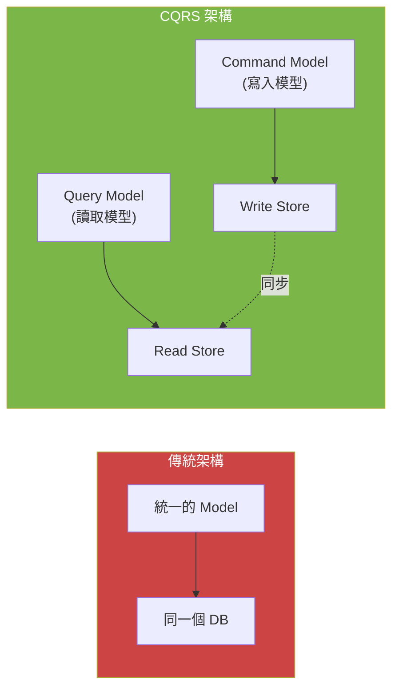
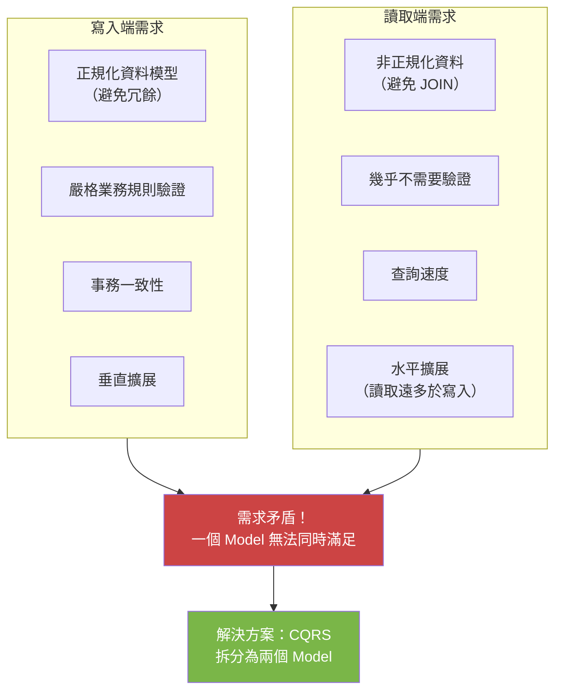
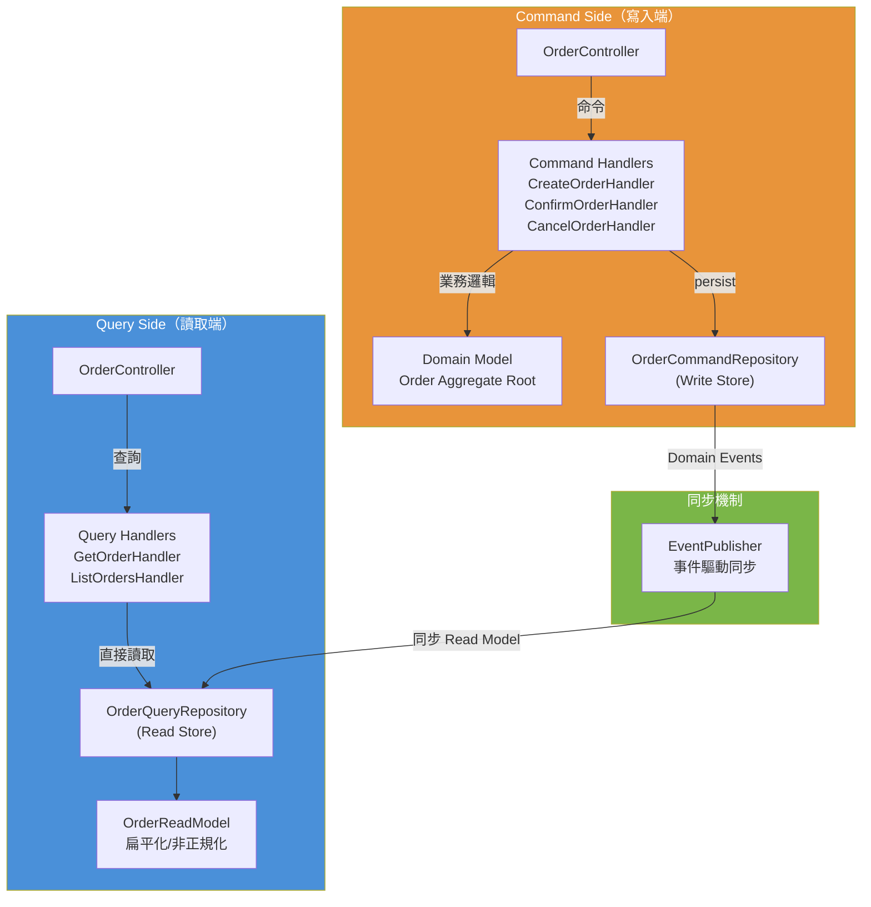
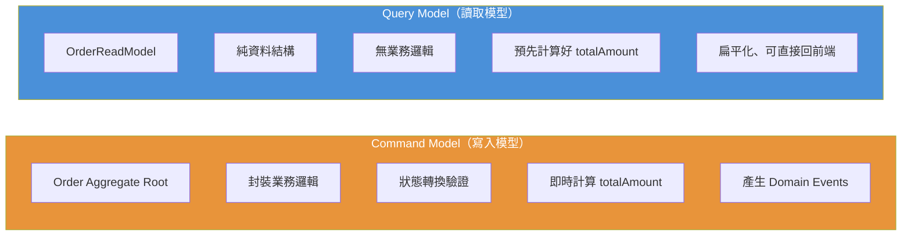
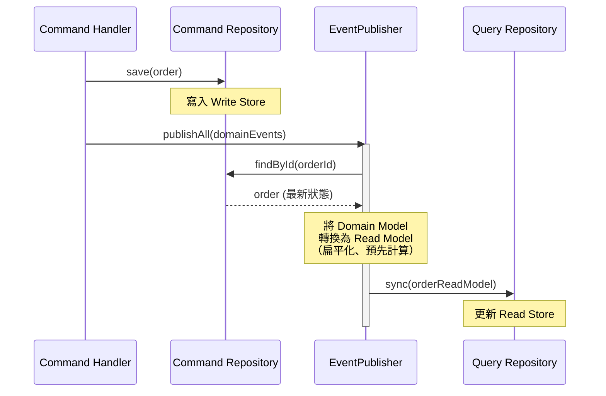
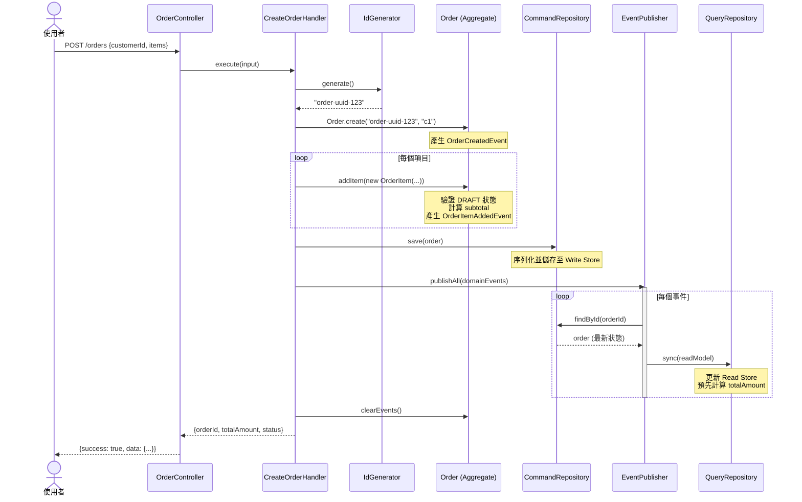
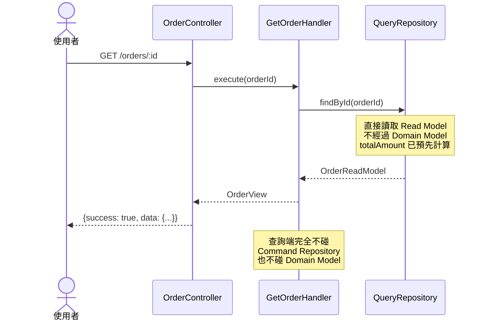
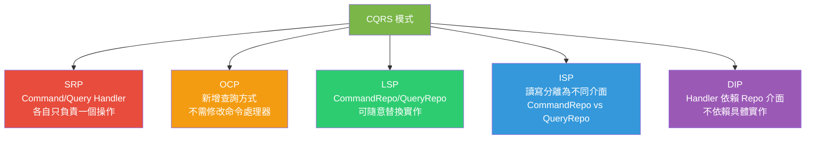
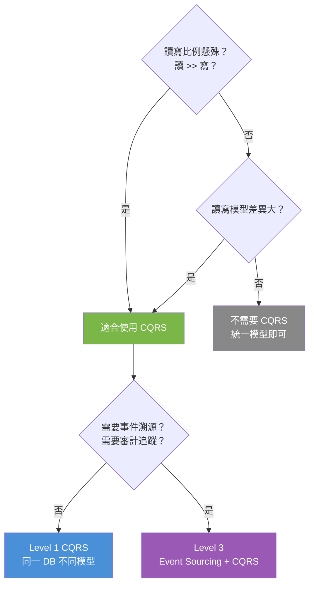

# CQRS 模式 (Command Query Responsibility Segregation)

## 命令查詢職責分離

由 Greg Young 基於 Bertrand Meyer 的 CQS (Command-Query Separation) 原則所提出。

---

## 核心思想

> **將「改變狀態的操作（Command）」和「讀取狀態的操作（Query）」分離到不同的模型與路徑中。**



---

## 為什麼需要 CQRS？

### 問題：讀寫需求的矛盾



| 面向 | 寫入端 | 讀取端 |
|------|--------|--------|
| 資料模型 | 正規化（避免冗餘） | 非正規化（避免 JOIN） |
| 效能優化 | 事務一致性 | 查詢速度 |
| 擴展方式 | 垂直擴展 | 水平擴展（讀取通常遠多於寫入） |
| 驗證需求 | 嚴格的業務規則 | 幾乎不需要 |
| 運算複雜度 | 高（業務邏輯） | 低（直接讀取） |

---

## 本專案中的 CQRS 實作

### 完整 CQRS 資料流



### Command Side（命令端 / 寫入端）

**相關檔案：**

```
src/application/commands/
├── CreateOrderHandler.ts    ← 建立訂單（Command）
├── ConfirmOrderHandler.ts   ← 確認訂單（Command）
└── CancelOrderHandler.ts    ← 取消訂單（Command）

src/application/ports/output/
└── OrderRepository.ts
    └── OrderCommandRepository  ← 寫入端儲存庫介面
```

**寫入端使用完整的 Domain Model（Order 聚合根）：**

```typescript
// CreateOrderHandler.ts - 經過完整的業務邏輯
async execute(input: CreateOrderInput): Promise<CreateOrderOutput> {
  const orderId = this.idGenerator.generate();
  const order = Order.create(orderId, input.customerId);  // ← Domain Model
  for (const item of input.items) {
    order.addItem(new OrderItem(...));  // ← 業務驗證在 Domain 中
  }
  await this.orderRepository.save(order);       // ← 寫入 Command Store
  await this.eventPublisher.publishAll([...]);   // ← 發布事件 → 觸發同步
}
```

### Query Side（查詢端 / 讀取端）

**相關檔案：**

```
src/application/queries/
└── GetOrderHandler.ts       ← 查詢訂單（Query）

src/application/ports/output/
└── OrderRepository.ts
    └── OrderQueryRepository    ← 讀取端儲存庫介面
```

**讀取端使用簡單的 Read Model（純資料結構）：**

```typescript
// GetOrderHandler.ts - 直接讀取，跳過 Domain 邏輯
async execute(orderId: string): Promise<OrderView> {
  const readModel = await this.queryRepository.findById(orderId);
  // 不需要 Domain Model，不需要業務邏輯計算
  // Read Model 的 totalAmount 已經預先計算好
  return { id: readModel.id, totalAmount: readModel.totalAmount, ... };
}
```

### 寫入模型 vs 讀取模型比較



```typescript
// Write Model - 正規化、封裝業務邏輯
class Order {
  private _items: OrderItem[] = [];
  private _status: OrderStatus = OrderStatus.DRAFT;

  get totalAmount(): number {
    return this._items.reduce((sum, item) => sum + item.subtotal, 0); // 即時計算
  }

  addItem(item: OrderItem): void {
    if (this._status !== OrderStatus.DRAFT) { throw ... }  // 業務驗證
    this._items.push(item);
  }
}

// Read Model - 非正規化、純資料結構
interface OrderReadModel {
  id: string;
  customerId: string;
  items: Array<{
    productId: string;
    productName: string;
    unitPrice: number;
    quantity: number;
    subtotal: number;    // ← 預先計算好
  }>;
  totalAmount: number;   // ← 預先計算好
  status: string;
  createdAt: string;
}
```

---

## 讀寫模型的同步

本專案使用**事件驅動的同步機制**：



**程式碼（InMemoryEventPublisher.ts）：**

```typescript
async publish(event: DomainEvent): Promise<void> {
  this.publishedEvents.push(event);
  await this.syncReadModel(event.aggregateId);  // ← 同步讀取模型
}

private async syncReadModel(orderId: string): Promise<void> {
  const order = await this.commandRepo.findById(orderId);
  if (!order) return;

  const readModel: OrderReadModel = {
    id: order.id,
    customerId: order.customerId,
    items: order.items.map((item) => ({
      productId: item.productId,
      productName: item.productName,
      unitPrice: item.unitPrice,
      quantity: item.quantity,
      subtotal: item.subtotal,        // ← 預先計算好
    })),
    totalAmount: order.totalAmount,    // ← 預先計算好
    status: order.status,
    createdAt: order.createdAt.toISOString(),
  };

  this.queryRepo.sync(readModel);
}
```

---

## CQRS 的三種演進層級

```mermaid
graph TB
    subgraph Level1["Level 1：同一 DB，不同模型（本專案）"]
        direction LR
        L1_CH["Command Handler"]
        L1_QH["Query Handler"]
        L1_CR["Command Repo"]
        L1_QR["Query Repo"]
        L1_DB["同一個<br/>In-Memory Store"]

        L1_CH --> L1_CR
        L1_QH --> L1_QR
        L1_CR -->|同步| L1_QR
        L1_CR --> L1_DB
        L1_QR --> L1_DB
    end

    subgraph Level2["Level 2：不同 DB"]
        direction LR
        L2_CH["Command Handler"]
        L2_QH["Query Handler"]
        L2_CR["Command Repo"]
        L2_QR["Query Repo"]
        L2_WDB["PostgreSQL<br/>（寫入優化）"]
        L2_RDB["Elasticsearch<br/>（讀取優化）"]
        L2_Bus["Event Bus<br/>（異步）"]

        L2_CH --> L2_CR --> L2_WDB
        L2_QH --> L2_QR --> L2_RDB
        L2_WDB -->|events| L2_Bus -->|projection| L2_RDB
    end

    subgraph Level3["Level 3：Event Sourcing + CQRS"]
        direction LR
        L3_CH["Command Handler"]
        L3_QH["Query Handler"]
        L3_ES["Event Store<br/>（只儲存事件）"]
        L3_MV["Materialized View<br/>（物化視圖）"]
        L3_Proj["Event Projection"]

        L3_CH --> L3_ES
        L3_ES -->|replay| L3_Proj -->|build| L3_MV
        L3_QH --> L3_MV
    end

    style Level1 fill:#7ab648,color:#fff
    style Level2 fill:#4a90d9,color:#fff
    style Level3 fill:#9b59b6,color:#fff
```



| 層級 | 說明 | 一致性 | 複雜度 | 本專案 |
|------|------|--------|--------|--------|
| **Level 1** | 同一 DB，不同模型 | 強一致 | 低 | ✅ |
| **Level 2** | 不同 DB（如 PostgreSQL + Elasticsearch） | 最終一致 | 中 | |
| **Level 3** | Event Sourcing + Materialized View | 最終一致 | 高 | |

---

## 完整循序圖：建立訂單



## 完整循序圖：查詢訂單



---

## CQRS 與 SOLID 原則的關係



| SOLID 原則 | CQRS 中的體現 |
|-----------|--------------|
| **SRP** | `CreateOrderHandler` 只管建立；`GetOrderHandler` 只管查詢 |
| **OCP** | 新增查詢（如按日期篩選）不需修改命令端 |
| **LSP** | `InMemoryQueryRepo` 可被 `ElasticsearchQueryRepo` 替換 |
| **ISP** | `OrderCommandRepository` 與 `OrderQueryRepository` 完全分離 |
| **DIP** | Handler 依賴 Repository 介面，DI Container 注入具體實作 |

---

## CQRS 優劣分析

| | 說明 |
|---|------|
| **優點** | |
| 讀寫獨立擴展 | 讀取端可加 cache/replica，寫入端可垂直擴展 |
| 讀取效能優化 | Read Model 可非正規化，預先計算，避免 JOIN |
| 模型簡化 | Command Model 專注業務邏輯，Query Model 專注展示 |
| 職責清晰 | Command/Query Handler 各司其職（SRP） |
| Event Sourcing 基礎 | CQRS 是 Event Sourcing 的必要基礎 |
| **缺點** | |
| 複雜度增加 | 需要維護兩套模型和同步機制 |
| 最終一致性 | Read Model 可能存在延遲（Level 2+） |
| 開發成本 | 每個操作需分開實作 Command 和 Query |
| 偵錯困難 | 事件驅動同步出錯時較難追蹤 |
| 不適合簡單 CRUD | 讀寫模型幾乎相同時是多此一舉 |

---

## 適用場景



### 適合使用 CQRS

- 讀寫比例懸殊（讀取 >> 寫入）
- 讀寫需要不同的資料模型
- 需要獨立擴展讀取和寫入
- 複雜的業務邏輯（Command Side）
- 多樣的查詢需求（Query Side）
- 需要事件溯源或審計追蹤

### 不適合使用 CQRS

- 簡單的 CRUD 應用
- 讀寫模型幾乎相同
- 強一致性需求（不能容忍延遲）
- 團隊對此模式不熟悉（學習成本高）
- 專案規模小、生命週期短
